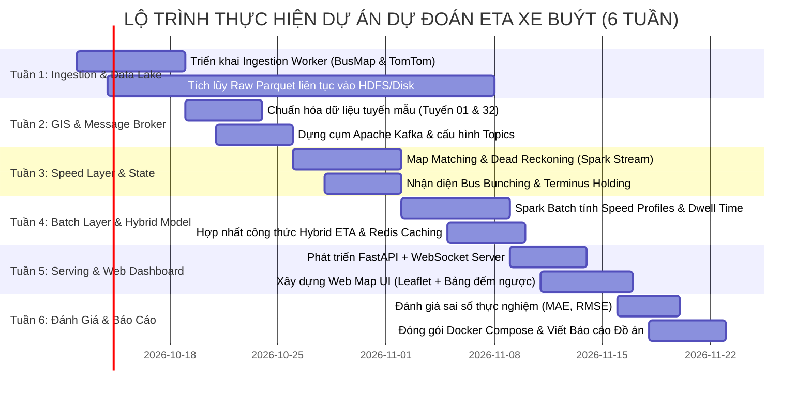

# 00. TỔNG QUAN HỆ THỐNG VÀ LỘ TRÌNH TRIỂN KHAI (PROJECT OVERVIEW & ROADMAP)

Hệ thống dự đoán thời gian xe buýt đến trạm (Estimated Time of Arrival - ETA) kết hợp dữ liệu lớn phân tán (Big Data) và thông tin giao thông đa nguồn. Bộ tài liệu này chuẩn hóa toàn bộ thiết kế kiến trúc, giải quyết triệt để các rào cản kỹ thuật và đề ra lộ trình thực thi rõ ràng cho nhóm.

---

## 1. Bản Đồ Điều Hướng Tài Liệu Kỹ Thuật

Bộ tài liệu được phân tách độc lập theo từng bài toán kỹ thuật chuyên biệt trong thư mục `docs/`:

```
Bus_tracking/
├── docs/
│   ├── 00_OVERVIEW_ROADMAP.md                     <-- Bạn đang ở đây: Tổng quan & Kế hoạch Sprint
│   ├── 01_BUSMAP_INGESTION_STRATEGY.md            <-- Chiến lược cào dữ liệu BusMap, chu kỳ 60-90s, Dead Reckoning
│   ├── 02_TOMTOM_TWO_TIER_TRAFFIC_OPTIMIZATION.md <-- Giải pháp Quota TomTom 2500 req/ngày, mô hình 2 tầng & Bus-as-a-Probe
│   ├── 03_BUS_BUNCHING_AND_DISPATCH_REGULATION.md <-- Phân tích dồn cụm xe buýt, nghiệp vụ holding xuất bến & chống sai lệch ETA
│   └── 04_ETA_MODELING_AND_LAMBDA_ARCHITECTURE.md <-- Kiến trúc Lambda hoàn chỉnh, công thức toán ETA, schema Kafka/HDFS/Redis
```

---

## 2. Bảng Đánh Giá Tính Khả Thi Toàn Diện (Feasibility Matrix)

| Khía Cạnh | Mức Độ Khả Thi | Phân Tích Thực Tế | Điểm Mấu Chốt Để Thành Công |
| :--- | :---: | :--- | :--- |
| **Nguồn dữ liệu GPS** | **9.0 / 10** | Đã thử nghiệm thành công qua [test.py](file:///z:/Desktop/Bus_tracking/test.py). API trả về danh sách xe cả tuyến, không chặn IP. Chu kỳ 60–90s hoàn toàn đáp ứng được. | Khởi động cron thu thập dữ liệu ngay lập tức để tích lũy kho Master Data cho tầng Batch. |
| **Nguồn dữ liệu Giao thông** | **8.5 / 10** | Đã test TomTom API trong `Test_tomtom`. Áp dụng thành công cơ chế **Truy vấn 2 tầng** và **Bus-as-a-Probe**, giúp lượng request chỉ tốn ~1.500/ngày (dưới trần 2.500). | Giới hạn BBox quét tầng 1 trong nội thành; chỉ drill-down tầng 2 cho tuyến đang theo dõi. |
| **Nghiệp vụ Điều độ (Bunching/Holding)** | **8.5 / 10** | Dễ dàng phát hiện trạng thái xe ở bến và bù đắp thời gian giãn cách vào công thức xuất phát động. | Phân loại trạng thái xe: `AT_TERMINUS`, `HOLDING`, `EN_ROUTE`. |
| **Hạ tầng Big Data (Lambda)** | **8.0 / 10** | Kiến trúc kinh điển (Kafka, Spark, HDFS, Redis/Mongo). Hoàn toàn phù hợp với tiêu chí môn học Lưu trữ và Xử lý Dữ liệu lớn. | Sử dụng **Docker Compose** để đóng gói toàn bộ cụm dịch vụ chạy ổn định trên máy phát triển hoặc server lab. |
| **Độ chính xác ETA** | **8.5 / 10** | Kết hợp đa tầng giúp sai số MAE kỳ vọng nằm trong khoảng $\pm 1.5 - 2.5$ phút trong đô thị Hà Nội. | Dùng bộ lọc làm mịn (Smoothing Filter) tránh giật số đếm ngược trên giao diện. |

---

## 3. Lộ Trình Triển Khai Chi Tiết (6-Week Sprint Plan)



### Chi tiết các Sprint:

#### Tuần 1: Kích hoạt Máy Thu Thập Dữ Liệu Ngay Lập Tức (Ưu tiên số 1)
- **Mục tiêu:** Không có dữ liệu lịch sử thì tầng Batch vô tác dụng. Do đó phải bật crawler chạy 24/7 từ tuần đầu tiên.
- **Deliverables:**
  - Viết worker `bus_collector.py` (chạy async, tần suất 80–120 req/phút quét tuyến).
  - Viết worker `traffic_collector.py` (chạy 5p/lần quét TomTom Incident BBox).
  - Ghi toàn bộ dữ liệu thô ra file JSON/Parquet phân vùng theo ngày.

#### Tuần 2: Chuẩn Hóa GIS & Thiết Lập Apache Kafka
- **Mục tiêu:** Chuẩn bị hạ tầng đường ống luồng và mạng lưới hình học.
- **Deliverables:**
  - Chọn **2 tuyến làm thí điểm** (ví dụ: Tuyến 01: BX Gia Lâm – BX Yên Nghĩa và Tuyến 32: BX Giáp Bát – Nhổn).
  - Trích xuất tọa độ trạm dừng chính xác và polyline của tuyến (từ OpenStreetMap/BusMap).
  - Dựng cụm Kafka trên Docker (`docker-compose.yml`), tạo các topic `raw-bus-telemetry`, `traffic-flow-events`.

#### Tuần 3: Tầng Tốc Độ (Speed Layer) & Xử Lý Dồn Cụm
- **Mục tiêu:** Bắt kịp luồng dữ liệu thời gian thực và xử lý độ trễ cập nhật.
- **Deliverables:**
  - Viết Spark Structured Streaming script tiêu thụ message từ Kafka.
  - Tích hợp hàm **Map Matching** chiếu GPS vào polyline tuyến.
  - Tích hợp thuật toán **Dead Reckoning** bù đắp chu kỳ 60–90s của BusMap.
  - Cài đặt Logic kiểm tra xe ở đầu bến (`AT_TERMINUS`) và tính toán `Holding_Delay`.

#### Tuần 4: Tầng Xử Lý Lô (Batch Layer) & Mô Hình Hợp Nhất ETA
- **Mục tiêu:** Khai phá tri thức quá khứ từ dữ liệu đã tích lũy trong 3 tuần.
- **Deliverables:**
  - Viết Spark Batch Job tính ma trận `Historical Speed Profile` theo khung giờ 15 phút và thứ trong tuần.
  - Tính toán bảng `Dwell Time Profile` tại từng trạm dừng.
  - Ghép nối công thức toán học ETA hợp nhất (Batch Speed + Real-time Speed + Traffic Incidents + Dwell Time + Holding Delay).
  - Đẩy kết quả ETA vào Redis hash table.

#### Tuần 5: Backend Serving & Giao Diện Dashboard Web
- **Mục tiêu:** Trực quan hóa sản phẩm cho người dùng cuối và hội đồng đánh giá.
- **Deliverables:**
  - Xây dựng FastAPI service truy vấn Redis và mở kênh WebSocket.
  - Xây dựng giao diện Web Dashboard (HTML5 + Leaflet.js / MapLibre):
    - Hiển thị xe buýt di chuyển trơn tru trên bản đồ.
    - Bảng điện tử đếm ngược ETA tới từng trạm dọc theo tuyến (giống bảng LED tại nhà chờ).
    - Cảnh báo các đoạn đường đang tắc nghẽn (tô màu đỏ/vàng theo dữ liệu TomTom).

#### Tuần 6: Đánh Giá Thực Nghiệm, Đóng Gói & Hoàn Thiện Báo Cáo
- **Mục tiêu:** Đo đạc các chỉ số khoa học và đóng gói sản phẩm.
- **Deliverables:**
  - Đánh giá sai số: Chạy kiểm định so sánh giữa ETA dự đoán trước 10, 20, 30 phút với thời điểm xe thực tế đến trạm. Báo cáo các chỉ số **MAE**, **RMSE**.
  - Đóng gói toàn bộ ứng dụng thành 1 file `docker-compose.up.yml` chạy được trọn vẹn từ zero.
  - Xuất báo cáo đồ án Big Data và slide thuyết trình.

