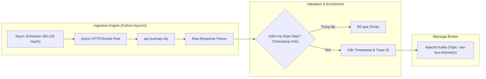

# 01. CHIẾN LƯỢC THU THẬP DỮ LIỆU GPS XE BUÝT (BUSMAP INGESTION STRATEGY)

Tài liệu này phân tích chi tiết phương pháp khai thác, thiết kế đường ống Ingestion và xử lý đặc tính nguồn dữ liệu vị trí xe buýt từ API `api.busmap.city`.

---

## 1. Đặc Tính Nguồn Dữ Liệu `api.busmap.city`

Dựa trên thử nghiệm thực tế từ script socket ([test.py](file:///z:/Desktop/Bus_tracking/test.py)), nguồn dữ liệu có các đặc thù kỹ thuật then chốt:

| Tiêu chí | Hiện trạng kỹ thuật | Ý nghĩa đối với hệ thống |
| :--- | :--- | :--- |
| **Phạm vi phản hồi (Scope)** | Trả về toàn bộ danh sách xe đang vận hành trên tuyến trong 1 request (`vehicle_hn/get?id={route_id}`) | Rất tối ưu: Không cần query từng xe lẻ. Một tuyến chỉ cần 1 request để cập nhật trạng thái mọi xe. |
| **Chu kỳ cập nhật máy chủ** | **60 giây – 90 giây** (máy chủ BusMap cập nhật vị trí mới từ thiết bị giám sát hành trình) | Gửi request tần suất quá dày (ví dụ 5s/lần) là lãng phí tài nguyên mạng vì dữ liệu trả về bị trùng lặp (stale data). |
| **Bảo mật & Rate Limit** | Không chặn IP gắt gao, sử dụng Header xác thực tĩnh (`client-version`, `device-id`, `package-name`) | Cho phép thu thập ổn định nhưng cần duy trì pool connection và xoay vòng session nhẹ để tránh bị gắn cờ DDoS. |
| **Khối lượng toàn mạng** | Hà Nội có khoảng 140–160 tuyến buýt đang hoạt động. | Cần điều tiết tần suất trong ngưỡng **80 – 120 requests/phút** để quét xoay vòng toàn mạng lưới. |

---

## 2. Thiết Kế Lập Lịch Thu Thập (Query Scheduling)

### 2.1. Phân bổ Ngân sách Truy vấn (80 - 120 req/phút)
Để quét toàn bộ ~150 tuyến xe buýt mà không tạo xung đột tải đột ngột (burst traffic):

- **Chu kỳ quét lặp (Loop Interval):** Cố định ở mức **75 giây** (nằm giữa khoảng 60s – 90s chu kỳ cập nhật của BusMap).
- **Phân bổ theo giây (Staggered Scheduling):**
  $$\text{Tốc độ query} = \frac{150 \text{ tuyến}}{75 \text{ giây}} = 2 \text{ requests/giây} \equiv 120 \text{ requests/phút}$$
- **Kỹ thuật Jitter & Leaky Bucket:** Tránh gửi đồng loạt 120 request vào đầu mỗi phút. Áp dụng thuật toán hàng đợi điều phối (Token Bucket hoặc Leaky Bucket) gửi đều đặn 2 request mỗi giây kèm độ trễ ngẫu nhiên (Jitter 100–300ms).

### 2.2. Phân nhóm Ưu tiên Tuyến (Priority Queue)
Không phải tuyến nào cũng có tần suất chạy xe giống nhau:
1. **Nhóm Tuyến Trục (Tier 1 - 30 tuyến trọng điểm):** Tuyến đi qua trục xuyên tâm hay kẹt xe (ví dụ: Tuyến 01, 02, 09, 32, 26...).
   - *Chu kỳ query:* 60 giây/lần.
2. **Nhóm Tuyến Phổ Thông (Tier 2 - 80 tuyến thông thường):**
   - *Chu kỳ query:* 90 giây/lần.
3. **Nhóm Tuyến Ngoại Thành / Ít xe (Tier 3 - các tuyến còn lại):**
   - *Chu kỳ query:* 120 giây/lần.

---

## 3. Thách Thức Độ Trễ 60s - 90s & Thuật Toán Nội Suy (Dead Reckoning)

### 3.1. Vấn đề "Bước nhảy không gian"
Với vận tốc xe buýt trung bình $20 - 30\text{ km/h}$ trong đô thị:
- Trong **60 giây**, xe di chuyển: $330\text{ m} - 500\text{ m}$.
- Trong **90 giây**, xe di chuyển: $500\text{ m} - 750\text{ m}$.
- **Hậu quả:** Nếu chỉ hiển thị vị trí thô từ API, trên bản đồ xe sẽ "đứng yên 1 phút rưỡi rồi dịch chuyển tức thời một đoạn nửa cây số". Hành khách nhìn vào ETA sẽ thấy hiện tượng đếm ngược không mượt hoặc nhảy cóc.

### 3.2. Thuật toán Nội suy Vị trí (Dead Reckoning & Map Snapping)
Tại tầng Speed Layer (Spark Streaming hoặc Ingestion Consumer):
1. **Map-matching:** Khóa (snap) tọa độ GPS nhận được vào hình học Polyline của tuyến.
2. **Tính toán vector vận tốc:**
   $$v_{estimate} = \frac{\Delta d}{\Delta t_{ping}}$$
3. **Linear / Spline Projection:** Trong khoảng thời gian chờ ping mới ($0 < t < 75s$), ước tính vị trí tức thời của xe:
   $$d(t) = d_{last\_ping} + \int_{0}^{t} v_{current}(\tau) d\tau$$
   *Lưu ý:* Khi khoảng cách $d(t)$ chạm tới một trạm dừng (Bus Stop), thuật toán chuyển trạng thái xe sang **Dwell/Stopping Mode** và tạm dừng cộng dồn khoảng cách cho đến khi nhận được ping xác nhận xe đã rời trạm.

---

## 4. Kiến Trúc Ingestion Worker & Đẩy vào Kafka



### 4.1. Kafka Topic Schema: `raw-bus-telemetry`
Dữ liệu từ Ingestion Worker được chuẩn hóa thành định dạng JSON/Avro nhỏ gọn trước khi đẩy vào Kafka topic:

```json
{
  "route_id": "01",
  "route_name": "BX Gia Lâm - BX Yên Nghĩa",
  "direction": 1,
  "ingest_timestamp": 1791379200,
  "vehicles": [
    {
      "vehicle_id": "29B-12345",
      "lat": 21.028511,
      "lng": 105.854444,
      "bearing": 185.0,
      "speed_kmh": 24.5,
      "recorded_at": 1791379185,
      "status": "RUNNING"
    }
  ]
}
```

### 4.2. Khắc phục Rủi ro API (Resilience & Failover)
1. **Keep-Alive & Connection Pooling:** Dùng `httpx.AsyncClient` hoặc duy trì Socket persistent pool để tái sử dụng bắt tay TLS/SSL, giảm tải CPU cho máy chủ và giảm latency mỗi request xuống dưới 50ms.
2. **Circuit Breaker:** Nếu API phản hồi mã lỗi `429 (Too Many Requests)` hoặc `403`:
   - Lập tức kích hoạt cơ chế `Exponential Backoff` (tạm dừng 10s $\to$ 20s $\to$ 40s).
   - Đổi `device-id` giả lập mới trong header.
3. **Data Replay Mode (Dành cho kiểm thử/bảo vệ đồ án):**
   - Lưu trữ song song toàn bộ file raw telemetry thu được trong 2 tuần vào thư mục `backup_traces/`.
   - Nếu ngày chấm đồ án API BusMap bảo trì hoặc gặp trục trặc, hệ thống có thể chuyển sang chế độ **Kafka Replay** phát lại dữ liệu thực tế theo thời gian thực mà người xem không nhận ra sự khác biệt.

