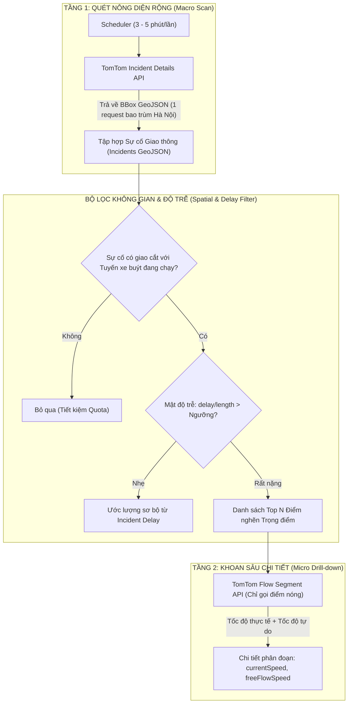
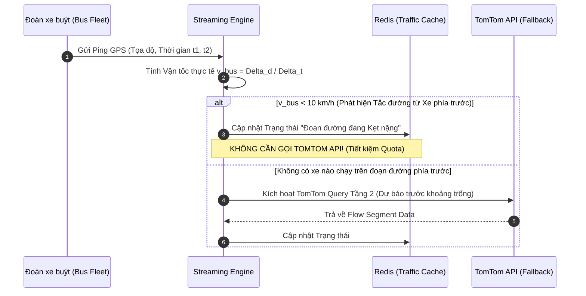

# 02. TỐI ƯU HÓA DỮ LIỆU GIAO THÔNG TOMTOM VỚI MÔ HÌNH TRUY VẤN 2 TẦNG (TWO-TIER TRAFFIC ARCHITECTURE)

Tài liệu này giải quyết bài toán giới hạn tài nguyên khắt khe của gói **TomTom Free Tier (2.500 requests/ngày)**, xây dựng mô hình truy vấn 2 tầng (Hierarchical Querying) và chiến lược kết hợp dữ liệu tự suy diễn từ xe buýt (Bus-as-a-Probe).

---

## 1. Bài Toán Giới Hạn Quota (2.500 Requests/Ngày)

### 1.1. Phân Tích Thực Trạng
- 1 ngày = $1.440\text{ phút}$. Nếu gửi request liên tục 24/7, ta chỉ có:
  $$\frac{2.500}{1.440} \approx 1{,}73 \text{ requests/phút}$$
- Một mạng lưới xe buýt có hàng trăm đoạn đường (road segments). Nếu mỗi phút đều kiểm tra trạng thái từng phân đoạn bằng TomTom Flow API, quota $2.500$ request sẽ **bị cạn sạch chỉ trong vòng chưa đầy 15 phút**!

### 1.2. Phân Bổ Ngân Sách Quota Theo Khung Giờ (Time-based Budgeting)
Xe buýt đô thị hoạt động chủ yếu từ $05:00$ đến $22:30$ ($17{,}5\text{ giờ} = 1.050\text{ phút}$). Hệ thống phân bổ hạn mức 2.500 request theo mức độ rủi ro ùn tắc:

| Khung giờ | Đặc điểm giao thông | Thời lượng | Tỷ lệ Quota | Số Requests cấp | Tần suất trung bình |
| :--- | :--- | :--- | :--- | :--- | :--- |
| **Cao điểm sáng (06:30 – 09:00)** | Tắc nghẽn nghiêm trọng, ETA biến động mạnh | 2.5 giờ (150p) | **35%** | **875 req** | ~5.8 req/phút |
| **Cao điểm chiều (16:30 – 19:30)** | Điểm nghẽn lan rộng toàn thành phố | 3.0 giờ (180p) | **40%** | **1.000 req** | ~5.5 req/phút |
| **Thấp điểm ngày (09:00 – 16:30, 19:30 – 22:30)** | Giao thông tương đối ổn định | 12.0 giờ (720p) | **20%** | **500 req** | ~0.7 req/phút (1.5p/req) |
| **Đêm (22:30 – 05:00)** | Xe buýt ngừng chạy hoặc rất thưa | 6.5 giờ (390p) | **5%** | **125 req** | Tắt hoặc kiểm tra baseline |

---

## 2. Kiến Trúc Truy Vấn 2 Tầng (Hierarchical Query Architecture)

Dựa trên cơ chế mà nhóm đã thử nghiệm thành công trong [Test_tomtom/map_traffic_hybrid.py](file:///z:/Desktop/Bus_tracking/Test_tomtom/map_traffic_hybrid.py), kiến trúc được chuẩn hóa như sau:

### 2.1. Tầng 1 - Quét Nông Diện Rộng (Macro Scan: TomTom Incident Details)
- **API Endpoint:** `traffic/services/5/incidentDetails` với tham số `bbox` bao quanh toàn thành phố (ví dụ Hà Nội: `105.75,20.95,105.90,21.08`).
- **Chi phí Quota:** **Chỉ tốn đúng 1 request cho toàn bộ sự cố thành phố!**
- **Chu kỳ thực thi:**
  - Giờ cao điểm: 3 phút/lần ($\implies 20\text{ req/giờ}$).
  - Giờ bình thường: 5–10 phút/lần.
- **Trích xuất thông tin:** Lọc ra danh sách tọa độ (Geometry LineString/MultiLineString), loại sự cố, tổng độ trễ `delay` (giây), và chiều dài đoạn tắc `length` (mét).

### 2.2. Bộ Lọc Không Gian Tuyến (Spatial Route Buffer Filtering)
Hầu hết các vụ tắc đường của thành phố không nằm trên tuyến xe buýt mà ta đang quan tâm. Do đó, hệ thống chạy bộ lọc không gian:
1. Tạo một vùng đệm không gian (Buffer Zone bán kính $30\text{m}$) dọc theo Polyline của tuyến xe buýt.
2. Thực hiện phép giao không gian (`Intersection` qua Shapely hoặc GeoPandas) giữa các LineString sự cố của TomTom và Buffer của tuyến buýt.
3. Chỉ giữ lại các sự cố nằm trực tiếp trên hành trình xe buýt sắp đi qua.

### 2.3. Tầng 2 - Khoan Sâu Điểm Nóng (Micro Drill-down: Flow Segment API)
- Khi phát hiện một sự cố trên tuyến có:
  $$\text{Delay Density} = \frac{\text{delay (giây)}}{\text{length (mét)}} \ge 0{,}5 \text{ (giây/m)}$$
  *(Nghĩa là di chuyển 100 mét mà mất thêm hơn 50 giây trễ - tương đương tốc độ < 7 km/h)*.
- Hệ thống chỉ gọi API `traffic/services/4/flowSegmentData` tại đúng tọa độ trọng tâm của đoạn tắc đó.
- **Quota tiêu thụ:** Mỗi tuyến chỉ drill-down tối đa $2 - 3$ điểm nghẽn nặng nhất. Tổng lượng gọi tầng 2 được kiểm soát nghiêm ngặt trong hạn mức quota theo giờ.

---

## 3. Đột Phá Kỹ Thuật: Cơ Chế "Xe Buýt Là Cảm Biến" (Bus-as-a-Probe)

Trong các bài toán Big Data giao thông, **dữ liệu GPS của chính đoàn xe buýt là nguồn thông tin tắc đường thời gian thực quý giá và miễn phí nhất**:

### 3.1. Nguyên lý Hoạt Động
- Trên một tuyến xe buýt, các xe chạy nối tiếp nhau cách nhau 10–15 phút.
- Xe buýt chạy trước chính là "xe trinh sát". Nếu xe đi trước vừa vượt qua ngã tư Đống Đa với vận tốc $6\text{ km/h}$ trong suốt 10 phút, hệ thống tự động suy ra phân đoạn này đang tắc đường nặng.
- **Giá trị đem lại:**
  1. Giảm thiểu $70\% - 80\%$ số lần phải gọi TomTom API tầng 2.
  2. Phản ánh đúng thực tế tốc độ của xe buýt (vốn nặng nề, dừng đỗ nhiều hơn xe con thông thường mà TomTom ghi nhận).

---

## 4. Bảng So Sánh Hiệu Quả Quota

| Phương án | Cơ chế truy vấn | Số Request/ngày | Tình trạng Quota (2.500) | Độ chính xác ETA |
| :--- | :--- | :--- | :--- | :--- |
| **Ngây thơ (Naive)** | Query Flow Segment liên tục cho mọi phân đoạn | $> 50.000$ | **Vượt mức 2000% (Bị khóa key ngay giờ đầu)** | Tốt nhưng bất khả thi |
| **Chỉ dùng Tầng 1** | Chỉ gọi Incidents BBox 5p/lần | $\approx 250$ | Thừa $90\%$ quota | Sai số vận tốc cao vì thiếu chi tiết Flow |
| **Hai Tầng Kết Hợp (Đề xuất)** | Tầng 1 (BBox) + Tầng 2 (Top Điểm nóng) + Phân bổ giờ cao điểm | $\approx 1.800 - 2.200$ | **Nằm hoàn toàn trong hạn ngạch Free** | Rất cao, chính xác tại các nút thắt cổ chai |
| **Hai Tầng + Bus-as-a-Probe** | Ưu tiên dữ liệu xe đi trước $\to$ Chỉ gọi TomTom cho đoạn mù | $\approx 1.200 - 1.500$ | **An toàn tuyệt đối, tối ưu chi phí** | Tối ưu nhất cho đồ án thực tế |

