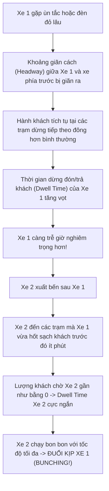
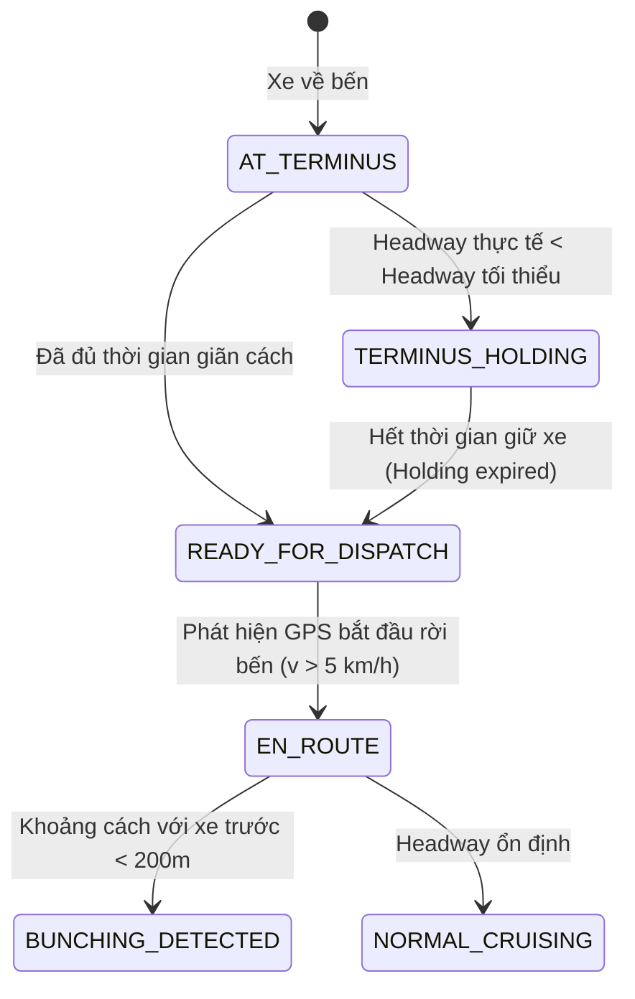

# 03. HIỆN TƯỢNG XE BUÝT DỒN CỤM (BUS BUNCHING) & MÔ HÌNH HÓA ĐIỀU ĐỘ XUẤT BẾN (DISPATCH REGULATION)

Tài liệu này phân tích hiện tượng vật lý giao thông **Bus Bunching (Xe buýt dồn cụm / đi thành đoàn)**, cơ chế **điều phối giãn cách (Headway Control / Holding)** của đơn vị vận hành thực tế (Transerco) và cách tích hợp các yếu tố này vào thuật toán dự đoán ETA để tránh sai số nghiêm trọng.

---

## 1. Cơ Chế Hình Thành "Bus Bunching" & Vòng Lặp Phản Hồi Xấu (Positive Feedback Loop)

### 1.1. Bản chất Vật lý Giao thông
Bus bunching là hiện tượng hai hoặc nhiều xe buýt cùng tuyến di chuyển sát sạt nhau (thậm chí xe sau bám đuôi xe trước) thay vì giữ khoảng cách thời gian đều đặn (Headway). Hiện tượng này xuất phát từ một vòng xoáy phản hồi khuếch đại:



### 1.2. Công Thức Thời Gian Chờ Của Hành Khách
Theo lý thuyết xếp hàng giao thông (Welding-Osuna Formula), thời gian chờ trung bình của hành khách tại trạm $E[W]$ được tính bởi:
$$E[W] = \frac{E[h]}{2} \left( 1 + \frac{\text{Var}(h)}{(E[h])^2} \right)$$
*Trong đó:*
- $E[h]$ là khoảng cách thời gian trung bình giữa các chuyến (Planned Headway, ví dụ 10 phút).
- $\text{Var}(h)$ là phương sai (độ lệch) khoảng cách thời gian thực tế giữa các chuyến.

> **Ý nghĩa cốt lõi:** Khi xảy ra hiện tượng dồn cụm, phương sai $\text{Var}(h)$ tăng vọt. Hành khách tại trạm sẽ phải chịu thời gian chờ đợi cực kỳ lâu (20–30 phút không có xe, nhưng khi xe tới thì 2–3 xe cùng ùa đến một lúc).

---

## 2. Nghiệp Vụ Điều Phối Thực Tế Của Bên Quản Lý Xe (Transit Dispatching)

Để triệt tiêu hiện tượng dồn cụm và giảm thiểu thời gian chờ trung bình cho hành khách, bên điều hành (ví dụ: Trung tâm Quản lý Giao thông Công cộng / Xí nghiệp Xe buýt Transerco) áp dụng các biện pháp can thiệp cưỡng bức:

### 2.1. Chiến Lược Giữ Xe Tại Đầu Bến (Terminus Holding Strategy)
Đây là nghiệp vụ phổ biến nhất:
- **Kịch bản:** Do tắc đường giờ cao điểm, Xe 1 và Xe 2 về bến cuối (Terminus) cách nhau chỉ 2–3 phút (thay vì 10–15 phút theo biểu đồ chuẩn).
- **Hành động điều phối:** Điều độ viên **tuyệt đối không cho Xe 2 quay đầu xuất bến ngay** sau Xe 1.
- Xe 2 sẽ bị giữ lại tại bến (Holding Time) một khoảng thời gian $\Delta t_{hold}$ để tái lập khoảng giãn cách an toàn mục tiêu ($h^*$).

### 2.2. Nhảy Trạm Cưỡng Bức (Stop-Skipping)
Khi xe trước bị quá tải nghiêm trọng, tổng đài điều độ có thể phát lệnh cho xe chạy sau bỏ qua 2–3 trạm phụ không có khách xuống để vượt lên trước chia sẻ tải khách ở các trạm trung chuyển lớn.

---

## 3. "Cái Bẫy" Chết Người Đối Với Thuật Toán Dự Đoán ETA Truyền Thống

Hầu hết các hệ thống dự đoán ETA ngây thơ (Naive ETA) gặp lỗi nghiêm trọng tại các trạm đầu tuyến vì không tính đến nghiệp vụ Holding:

```
[Đầu Bến: BX Giáp Bát] ------------------- (500m) -------------------> [Trạm Dừng Số 1: ĐH Kinh Tế]
   (Xe buýt đang đỗ)
```

- **Tính toán ngây thơ:**
  $$\text{Khoảng cách} = 500\text{m}; \quad \text{Vận tốc} = 25\text{ km/h} \implies ETA = \frac{0{,}5}{25} \times 60 \approx 1{,}2 \text{ phút}$$
  $\implies$ Ứng dụng thông báo cho hành khách tại Trạm 1: *"Xe sẽ tới sau 1 phút"*.
- **Thực tế diễn ra:** Xe đang phải chịu lệnh **Holding 12 phút** tại bến để chờ giãn cách với xe vừa xuất phát.
- **Hậu quả:** Hành khách tại Trạm 1 đứng đợi 13–15 phút trong khi app liên tục báo "1 phút". Người dùng đánh giá sản phẩm là rác và sai lệch hoàn toàn.

---

## 4. Mô Hình Hóa Thuật Toán Dự Đoán ETA Kháng Dồn Cụm (Bunching-Aware ETA)

Hệ thống cần bổ sung một máy trạng thái (State Machine) và cơ chế điều chỉnh thời gian xuất bến động:



### 4.1. Nhận Diện & Ước Tính Thời Gian Xuất Bến Động ($\widehat{T}_{departure}$)
Đối với các xe đang ở khu vực đầu bến (`AT_TERMINUS`), công thức thời gian xuất bến không lấy theo lịch tĩnh, mà lấy theo giá trị lớn hơn giữa:
1. Giờ xuất bến theo kế hoạch ($T_{scheduled}$).
2. Giờ xuất bến điều chỉnh theo Headway mục tiêu:
   $$\widehat{T}_{departure}(i) = \max \left( T_{scheduled}(i), \quad T_{actual\_departure}(i-1) + h_{target} \right)$$
   *Trong đó:*
   - $T_{actual\_departure}(i-1)$ là thời điểm thực tế xe đi trước rời bến.
   - $h_{target}$ là khoảng giãn cách mục tiêu của tuyến trong khung giờ đó (ví dụ: 10 phút vào cao điểm, 15 phút vào thấp điểm).

### 4.2. Hiệu Chỉnh Thời Gian Dừng Đón Khách (Dynamic Dwell Time Adjustment)
Khi hệ thống phát hiện hai xe trên tuyến đang có dấu hiệu dồn cụm (khoảng cách thời gian co lại còn $< 3$ phút):

- **Đối với Xe đi trước (Lead Bus):**
  Hệ thống nhân hệ số trễ đón khách:
  $$\tau_{dwell}^{lead}(S_k) = \tau_{dwell\_baseline}(S_k) \times \left( 1 + \gamma \cdot \frac{h_{actual} - h_{target}}{h_{target}} \right)$$
  *(Vì xe trước phải gánh toàn bộ lượng khách dồn lại, $\gamma \approx 0.5 - 0.8$).*

- **Đối với Xe đi sau (Follower Bus):**
  Hệ thống giảm trừ thời gian dừng đón khách về mức tối thiểu (chỉ bằng thời gian mở/đóng cửa và trả khách xuống):
  $$\tau_{dwell}^{follower}(S_k) = \max \left( \tau_{min\_door\_open}, \quad \tau_{dwell\_baseline}(S_k) \times 0.4 \right)$$

### 4.3. Công Thức ETA Hợp Nhất Tại Trạm $S_k$ Cho Xe Chưa Rời Bến
$$ETA(S_k) = \underbrace{\left( \widehat{T}_{departure} - T_{current} \right)}_{\text{Thời gian chờ xuất bến (Holding Delay)}} + \underbrace{\sum_{j=1}^{k} \frac{d(S_{j-1}, S_j)}{v_{traffic}(S_{j-1}, S_j)}}_{\text{Thời gian di chuyển thực tế}} + \underbrace{\sum_{j=1}^{k-1} \tau_{dwell}(S_j)}_{\text{Tổng thời gian dừng đón khách}}$$

---

## 5. Giá Trị Điểm Nhấn Cho Đồ Án Big Data
Việc tích hợp cơ chế **Bus Bunching & Dispatch Regulation** nâng tầm đồ án từ một bài tập CRUD vị trí thông thường thành một hệ thống **Intelligent Transportation Systems (ITS)** chuyên nghiệp:
1. Thể hiện sự am hiểu sâu sắc về nghiệp vụ vận hành xe buýt thực tế tại Việt Nam.
2. Xóa bỏ hoàn toàn hiện tượng "nhảy cóc ETA" hoặc "đếm ngược ảo" ở các trạm đầu bến.
3. Cung cấp chỉ số phân tích bổ sung trên Dashboard giám sát: **Cảnh báo nguy cơ dồn cụm (Bunching Risk Alert)** hỗ trợ chính đơn vị điều phối.

