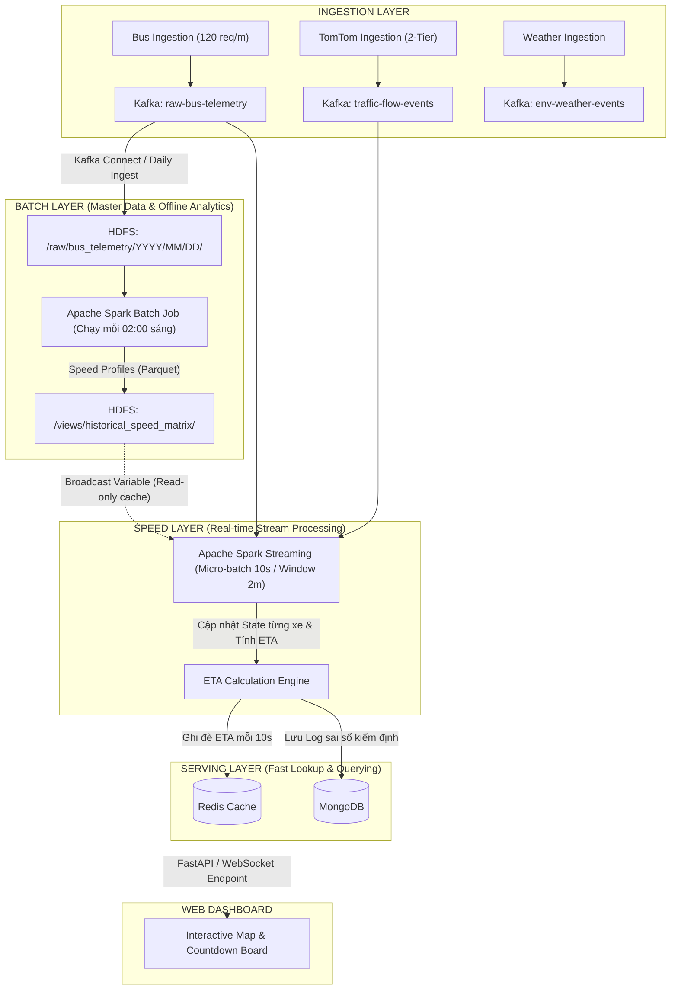

# 04. THIẾT KẾ MÔ HÌNH DỰ ĐOÁN ETA & KIẾN TRÚC LAMBDA TOÀN DIỆN (HYBRID ETA & LAMBDA ARCHITECTURE)

Tài liệu này chuẩn hóa toàn bộ mô hình toán học dự đoán ETA đa nguồn và chi tiết kỹ thuật triển khai trên Kiến trúc Lambda (Apache Kafka, HDFS, Apache Spark, NoSQL Serving).

---

## 1. Công Thức Toán Học Dự Đoán ETA Hợp Nhất (Comprehensive ETA Formulation)

Thời gian dự kiến xe buýt $v$ đến trạm đích $S_k$ tại thời điểm hiện tại $t_{now}$ được mô hình hóa thành 4 thành phần độc lập:

$$\text{ETA}(v, S_k, t_{now}) = \Delta t_{dispatch} + \Delta t_{current\_seg} + \sum_{m = i+1}^{k-1} \Delta t_{travel}(S_m \to S_{m+1}) + \sum_{m = i}^{k-1} \tau_{dwell}(S_m)$$

```
[Vị trí hiện tại của Xe] 
        |
        |--- (1) Đoạn đường đang chạy dở: Quãng đường còn lại / Vận tốc tức thời
        v
    [Trạm Si] --- (3) Dừng đón trả khách: Dwell Time
        |
        |--- (2) Các đoạn đường tiếp theo: Quãng đường phân đoạn / Vận tốc tích hợp (Batch + Speed + Traffic)
        v
    [Trạm Si+1] --- Dừng đón trả khách
        |
       ...
        v
    [Trạm Đích Sk]
```

### 1.1. Chi tiết từng thành phần:

1. **Độ trễ xuất bến ($\Delta t_{dispatch}$):**
   - Nếu xe đang chạy trên tuyến (`EN_ROUTE`): $\Delta t_{dispatch} = 0$.
   - Nếu xe đang đỗ ở đầu bến (`AT_TERMINUS`):
     $$\Delta t_{dispatch} = \max\left( 0, \; \widehat{T}_{departure} - t_{now} \right)$$
     *(Áp dụng công thức Headway Holding từ tài liệu 03).*

2. **Thời gian hoàn thành phân đoạn hiện tại ($\Delta t_{current\_seg}$):**
   - Khoảng cách còn lại đến trạm kế tiếp $S_i$: $d_{rem} = \text{distance\_to\_stop}(v_{coord}, S_i)$.
   - Vận tốc tính toán ưu tiên vận tốc tức thời mượt mà (Smoothed Instantaneous Speed):
     $$\Delta t_{current\_seg} = \frac{d_{rem}}{v_{smoothed}(v)}$$
     *(Với $v_{smoothed} = \beta \cdot v_{ping\_now} + (1-\beta) \cdot v_{ping\_prev}$, tránh trường hợp xe vừa dừng đèn đỏ làm vận tốc rơi về 0 gây chia cho 0).*

3. **Thời gian di chuyển các phân đoạn tương lai ($\Delta t_{travel}$):**
   Vận tốc trên phân đoạn $(S_m \to S_{m+1})$ được hợp nhất từ 3 nguồn:
   $$v_{segment}(S_m \to S_{m+1}) = w_1 \cdot \bar{v}_{batch} + w_2 \cdot v_{probe\_bus} + w_3 \cdot v_{tomtom}$$
   *Trong đó:*
   - $\bar{v}_{batch}$: Vận tốc trung bình lịch sử từ HDFS Spark Batch (theo thứ trong tuần, khung giờ 15 phút, thời tiết).
   - $v_{probe\_bus}$: Vận tốc của xe buýt chạy ngay phía trước trên cùng phân đoạn đó (nếu có xe chạy trước trong vòng 10 phút gần đây).
   - $v_{tomtom}$: Vận tốc lấy từ TomTom Flow Segment API (nếu phân đoạn nằm trong danh sách điểm nóng tầng 2).
   - Trọng số $w_1 + w_2 + w_3 = 1$ (thay đổi động: ưu tiên $v_{probe\_bus}$ cao nhất nếu có dữ liệu; nếu không có xe trước và không kẹt thì dùng $\bar{v}_{batch}$).

4. **Tổng thời gian dừng đón/trả khách ($\tau_{dwell}$):**
   $$\tau_{dwell}(S_m) = \bar{\tau}_{history}(S_m, \text{timeslot}) \times \kappa_{bunching}$$
   - $\bar{\tau}_{history}$: Thời gian dừng lịch sử tại trạm $S_m$.
   - $\kappa_{bunching}$: Hệ số điều chỉnh dồn cụm (1.3–1.6 nếu là Lead Bus gánh khách; 0.4–0.5 nếu là Follower Bus).

---

## 2. Chi Tiết Các Tầng Trong Kiến Trúc Lambda



---

## 3. Thiết Kế Chi Tiết Từng Module Kỹ Thuật

### 3.1. Kafka Topics Specification

| Tên Topic | Key | Message Format | Tần suất đẩy | Partition Key |
| :--- | :--- | :--- | :--- | :--- |
| `raw-bus-telemetry` | `route_id` | JSON/Avro (Tọa độ xe, hướng, tốc độ, timestamp) | 60–75s / tuyến | Phân vùng theo `route_id` |
| `traffic-flow-events`| `segment_id` | JSON (Mã phân đoạn, currentSpeed, freeFlowSpeed, delay) | 3–5 phút (hoặc khi có event) | `segment_id` |
| `dispatch-events` | `route_id` | JSON (Giờ xuất bến thực tế, lệnh holding) | Khi xe rời ga | `route_id` |

### 3.2. Cấu Trúc HDFS Batch Layer
- Đường dẫn lưu trữ: `/datalake/bus_tracking/raw/route={route_id}/year={YYYY}/month={MM}/day={DD}/data.parquet`
- **Spark Batch Job:**
  - Đầu vào: Hàng triệu ping GPS tích lũy trong nhiều tuần.
  - Xử lý: Phân nhóm theo `(route_id, segment_index, day_of_week, hour_of_day, 15min_slot)`.
  - Đầu ra: Bảng tra cứu tốc độ cơ sở (`speed_profile_lookup`):
    ```
    (route_id: "01", segment: 12, dow: 2 (Thứ 2), slot: "07:30", avg_speed: 14.2 km/h, std_dev: 3.1)
    ```

### 3.3. Spark Streaming State Management (Speed Layer)
Spark Structured Streaming sử dụng cơ chế `mapGroupsWithState` để duy trì bộ nhớ ngắn hạn cho từng chiếc xe:
- **State Object của mỗi xe:**
  ```scala
  case class VehicleState(
      vehicleId: String,
      routeId: String,
      lastLat: Double,
      lastLng: Double,
      lastPingTime: Long,
      currentSegmentIndex: Int,
      smoothedSpeed: Double,
      distFromTerminus: Double,
      status: String // "AT_TERMINUS", "HOLDING", "EN_ROUTE"
  )
  ```
- **Xử lý trượt cửa sổ (Sliding Window):** Giúp phát hiện ngay xe dừng đỗ tại ngã tư hoặc trạm dừng, tự động nội suy vị trí mượt mà giữa các chu kỳ 60s của BusMap API.

### 3.4. Redis Data Structures (Serving Layer)
Để Frontend truy vấn tức thì với độ trễ $< 10\text{ ms}$:
1. **Hash Table ETA theo trạm:**
   - **Key:** `eta:{route_id}:{stop_id}`
   - **Fields:**
     - `next_bus_id`: `"29B-12345"`
     - `eta_seconds`: `420` (7 phút)
     - `distance_meters`: `1850`
     - `traffic_status`: `"HEAVY_CONGESTION"`
     - `updated_at`: `1791379205`
2. **Geo Spatial Vị trí xe buýt thời gian thực:**
   - Dùng lệnh `GEOADD vehicles:{route_id} <lng> <lat> <vehicle_id>`
   - Frontend chỉ cần gọi `GEORADIUS` hoặc đọc `HGETALL` để render xe di chuyển trên bản đồ.

---

## 4. Đánh Giá Sai Số & Kiểm Thử Mô Hình (Validation & Metrics)

Để bảo vệ kết quả đồ án Big Data xuất sắc trước hội đồng, hệ thống tích hợp sẵn module tự động đánh giá sai số giữa **ETA dự đoán** và **Thời gian thực tế xe đến trạm**:

1. **Mean Absolute Error (MAE):**
   $$\text{MAE} = \frac{1}{N} \sum_{k=1}^N \left| \text{ETA}_{predicted}(k) - \text{Time}_{actual}(k) \right|$$
   - *Mục tiêu:* MAE $< 2{,}5\text{ phút}$ (đạt chuẩn chất lượng thực tế ở giao thông đô thị Việt Nam).
2. **Root Mean Squared Error (RMSE):**
   - Đánh giá mức độ nhạy cảm với các trường hợp dự đoán sai lệch lớn.
3. **Ablation Study (Kiểm chứng thành phần - Điểm cộng đồ án):**
   Thực hiện so sánh 3 cấu hình:
   - *Baseline 1:* Vận tốc cố định tĩnh (Static Average Speed) $\to$ Sai số cao nhất.
   - *Baseline 2:* Chỉ dùng GPS tức thời (No Batch, No Traffic) $\to$ Dễ bị giật cục.
   - *Đề xuất (Proposed):* Lambda Hybrid (Batch Speed Profile + 2-Tier TomTom + Bunching Control) $\to$ Sai số tối ưu nhất.

