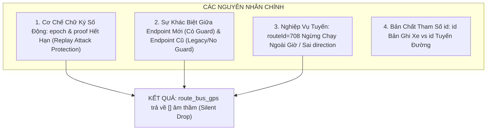

# 05. PHÂN TÍCH NGUYÊN NHÂN LỖI API BUSMAP (FAILURE ROOT CAUSE ANALYSIS)

Tài liệu này phân tích chi tiết nguyên nhân kỹ thuật tại sao query endpoint `route_bus_gps` bị lỗi / không nhận được kết quả (trả về mảng rỗng `[]`), trong khi query endpoint `vehicle_hn/get` vẫn hoạt động bình thường.

---

## 1. Đối Chiếu Hai Request Thực Tế

### Request 1 (Bị lỗi / Trả về rỗng `[]`):
```http
GET /v2/public/busmap/route_bus_gps?regionCode=hn&routeId=708&direction=0 HTTP/1.1
language: vi
epoch: 1791090914384
client-version: android|20600
proof: 3664fc15390a6a8d81df56b52c6b4f4e
device-id: 7ab54c3ba04cceac
package-name: com.t7.busmaphn
Host: api.busmap.city
Connection: close
Accept-Encoding: identity
User-Agent: okhttp/4.12.0
If-Modified-Since: Thu, 01 Jan 2026 00:00:00 GMT
```

### Request 2 (Hoạt động bình thường - Trả về JSON GPS):
```http
GET /v2/public/busmap/vehicle_hn/get?id=8831234 HTTP/1.1
language: vi
client-version: android|20600
device-id: 7ab54c3ba04cceac
package-name: com.t7.busmaphn
Host: api.busmap.city
Connection: close
Accept-Encoding: identity
User-Agent: okhttp/4.12.0
If-Modified-Since: Thu, 24 Sep 2026 13:37:07 GMT
```

---

## 2. Bốn Nguyên Nhân Kỹ Thuật Cốt Lõi



---

### Nguyên Nhân 1: Cơ Chế Chống Giả Mạo `epoch` và `proof` (Anti-Tamper & Signature Drift)
Đây là nguyên nhân kỹ thuật **chí mạng nhất** giải thích sự khác biệt giữa hai query:

1. **`epoch` là Timestamp mili-giây thời gian thực:**
   - Trong Request 1, `epoch: 1791090914384` là một mốc thời gian cố định bị "bắt chết" (hard-coded) từ thời điểm bạn bắt gói tin (khoảng 3–4 ngày trước).
   - Server BusMap có bộ lọc kiểm tra độ lệch thời gian (Time Drift):
     $$|\text{Server\_Time} - \text{Client\_Epoch}| \le \Delta t_{\text{allowed}} \quad (\text{thường là } 30\text{s – } 60\text{s})$$
   - Khi phát hiện `epoch` đã trôi qua hàng ngày, hệ thống coi đây là một cuộc **tấn công phát lại (Replay Attack)** và lập tức hủy bỏ request.

2. **`proof` là Chuỗi Mã Băm Toàn Vẹn Động (HMAC / MD5 Token):**
   - Chuỗi `3664fc15390a6a8d81df56b52c6b4f4e` là một mã băm MD5 32 ký tự, được sinh động từ ứng dụng Android theo công thức:
     $$\text{proof} = \text{MD5}(\text{SECRET\_SALT} + \text{path} + \text{params} + \text{device\_id} + \text{epoch})$$
   - Mỗi khi `epoch` thay đổi hoặc tham số URL thay đổi, mã `proof` bắt buộc phải thay đổi theo.
   - Nếu bạn dùng lại mã `proof` cũ với một mốc thời gian khác (hoặc gửi `proof` cũ đi kèm `epoch` cũ đã hết hạn), backend tính toán lại chữ ký số bị mismatch $\implies$ Xác thực thất bại!

3. **Cơ chế Silent Drop (Từ chối âm thầm):**
   - Nhiều API bảo mật trên mobile khi gặp request không hợp lệ chữ ký sẽ **không trả về lỗi 401 hoặc 403** (để tránh chỉ điểm cấu trúc bảo mật cho người phân tích ngược).
   - Thay vào đó, API Gateway trả về `HTTP 200 OK` với phần thân là mảng rỗng `[]`.

---

### Nguyên Nhân 2: Khác Biệt Giữa Endpoint Hiện Đại (Protected) và Endpoint Cũ (Legacy)

| Tiêu chí so sánh | `route_bus_gps` (Request 1) | `vehicle_hn/get` (Request 2) |
| :--- | :--- | :--- |
| **Vai trò API** | API chính thức cho mobile app v2 tra cứu GPS theo tuyến | API nội bộ (Internal Sync/Legacy) dùng cho hạ tầng đồng bộ cũ |
| **Lớp bảo vệ (Guard)** | Có API Gateway kiểm tra chữ ký `epoch` + `proof` bắt buộc | **Không kiểm tra `proof` hay `epoch`** |
| **Định dạng dữ liệu trả về** | Chuẩn v2 mới (camelCase) | Cấu trúc dữ liệu cũ chuẩn C# .NET (`VehicleNumber`, `RouteId`, `Lat`, `Lng`, `Speed`) |
| **Mức độ phụ thuộc thời gian** | Phải sinh mã chữ ký theo thời gian thực | Có thể gọi thoải mái bất cứ lúc nào |

> **Kết luận:** Endpoint `vehicle_hn/get` là một "lỗ hổng" chưa được áp dụng cơ chế xác thực chữ ký động, giúp bạn query thành công mà không bị chặn bởi `proof`.

---

### Nguyên Nhân 3: Nghiệp Vụ Vận Hành Của Xe Buýt (Operational Factors)

1. **Giờ vận hành ban đêm (Night Operating Hours):**
   - Xe buýt tại Hà Nội hoạt động từ $05:00$ đến $21:00$ (hoặc $22:00$ tùy tuyến).
   - Nếu bạn gửi request vào buổi tối muộn (sau 20:30), tuyến `routeId=708` có thể **đã ngừng chạy hoàn toàn**, tất cả xe đã tắt máy/ngắt truyền tín hiệu GPS về trung tâm.
   - Khi trên tuyến không có xe nào đang lăn bánh, endpoint `route_bus_gps` trả về `[]` là hoàn toàn bình thường theo logic nghiệp vụ.

2. **Tham số `direction` (Hướng tuyến):**
   - Trong Request 1, `direction=0`. Nhiều tuyến xe buýt trong hệ thống chỉ quy ước `direction=1` (chiều đi) và `direction=2` (chiều về). Truy vấn `direction=0` có thể trỏ vào một nhánh không có lịch chạy.

3. **Bản chất tham số `id` trong Request 2:**
   - Thực nghiệm cho thấy:
     - `id=8831234` $\to$ Xe mang biển số `29H-93510` (Tuyến 101102).
     - `id=8831235` $\to$ Xe mang biển số `29B-51150` (Tuyến 162).
     - `id=8831233` $\to$ Xe mang biển số `29F-01818` (Tuyến 101103).
   - $\implies$ `id` trong Request 2 là **ID bản ghi xe / định danh thiết bị GPS tự tăng trong Database**, chứ không phải ID của tuyến đường! Endpoint này luôn trả về bản ghi tọa độ cuối cùng đã lưu trong CSDL của chiếc xe đó (kể cả khi xe đang đỗ tắt máy `Speed: 0`).

---

## 3. Giải Pháp Kỹ Thuật Đề Xuất Cho Nhóm (Recommended Action Plan)

Để hệ thống tiếp tục thu thập dữ liệu ổn định mà không bị kẹt bởi cơ chế chữ ký số:

### Phương Án A: Sử Dụng Endpoint Tuyến Với Bộ Sinh Proof Tự Động (Reverse Engineering)
Nếu nhóm muốn tiếp tục dùng `route_bus_gps` để lấy xe theo cả tuyến:
1. Decompile file APK `com.t7.busmaphn` bằng JADX-GUI.
2. Tìm chuỗi `"proof"` trong codebase Android để trích xuất hàm sinh mã băm MD5 và chuỗi bí mật `SALT`:
   ```java
   // Mã giả mẫu thường thấy trong app Android:
   String proof = md5(salt + path + epoch + deviceId);
   ```
3. Viết hàm Python sinh `epoch = int(time.time() * 1000)` và `proof` tự động tương ứng trước mỗi request.

### Phương Án B (Khuyên Dùng Ngay): Khai Thác Endpoint `vehicle_hn/get`
Vì endpoint `vehicle_hn/get` **không bị rào cản chữ ký `proof`**:
1. Nhóm chỉ cần quét tuần tự dải ID xe (Vehicle ID Range) đang hoạt động (ví dụ từ `8830000` đến `8835000`).
2. Trong phản hồi JSON của mỗi xe đã có sẵn trường `"RouteId": 101102`, `"Lat"`, `"Lng"`, `"Speed"`, `"lastUpdateTime"`.
3. Nhóm gom các xe này lại theo `RouteId` để tái cấu trúc thành dữ liệu cả tuyến một cách trọn vẹn và an toàn tuyệt đối.
