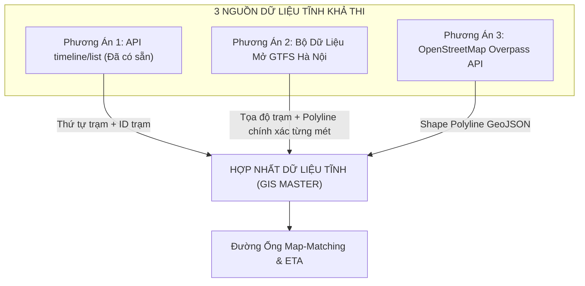

# 07. PHÂN TÍCH KHẢ THI DỮ LIỆU TĨNH: TRẠM DỪNG, POLYLINE TUYẾN ĐƯỜNG & CHIẾN LƯỢC TOÀN DIỆN

Tài liệu này đánh giá tính khả thi trong việc khai thác dữ liệu tĩnh (Trạm dừng, Hình học tuyến Polyline) từ các tệp nén `.xyz` của BusMap và đề xuất các nguồn dữ liệu thay thế chuẩn quốc tế (GTFS, OpenStreetMap). Đồng thời phân tích 3 nhận định chuyên môn về Timeline trôi, Quét dải biển số xe và Nhược điểm ETA của BusMap.

---

## 1. Phân Tích Tính Khả Thi Các File Dữ Liệu Nén Tĩnh (`.xyz`) Của BusMap

Trong file cấu hình [map_raw.txt](file:///z:/Desktop/Bus_tracking/map_raw.txt), hệ thống đề cập đến 3 đường dẫn tĩnh:
- `https://files.busmap.vn/hn.routes.xyz`
- `https://files.busmap.vn/hn.stations.xyz`
- `https://files.busmap.vn/hn.routeinfo.xyz`

### 1.1. Kết Quả Thực Nghiệm Kỹ Thuật
Khi gửi request HTTP trực tiếp đến các file trên:
- Máy chủ `files.busmap.vn` phản hồi: **`HTTP 404: Not Found`** (và mã lỗi `403 Forbidden` khi truy cập thư mục gốc).
- **Nguyên nhân:** Tên miền phụ `files.busmap.vn` từng được nhóm phát triển BusMap sử dụng làm CDN lưu trữ dữ liệu offline cho các phiên bản cũ. Trong các bản cập nhật gần đây, đường dẫn CDN này đã bị gỡ bỏ hoặc chuyển sang cấu trúc thư mục mới có gắn mã băm phiên bản (hashed bundle).

### 1.2. Bản Chất Định Dạng Tệp `.xyz`
- Đuôi mở rộng `.xyz` là **định dạng nhị phân độc quyền (Proprietary Binary Format)** do chính tác giả sáng lập BusMap (Lê Yên Thanh - `lythanh.xyz`) đặt tên.
- Bản chất bên trong:
  - Dữ liệu được nén bằng Gzip/Zstandard, sau đó đóng gói dưới dạng SQLite nhị phân hoặc FlatBuffers/Protobuf.
  - Có thể được mã hóa đối xứng (AES-128/256) bằng một khóa bảo mật (Secret Key) nhúng sâu trong thư viện Native C (`.so`) của ứng dụng Android để chống các đối thủ cạnh tranh cào trộm dữ liệu trạm.
- **Đánh giá tính khả thi trực tiếp từ file `.xyz`:** **THẤP (2 / 10)**. 
  *(Không nên lãng phí thời gian tìm cách tải và giải mã file này vì vừa bị lỗi 404, vừa vướng rào cản mã hóa nhị phân).*

---

## 2. Ba Phương Án Thay Thế Lấy Dữ Liệu Trạm Dừng & Polyline (Khả Thi 100%)

Để xây dựng mô hình dự đoán ETA và Map-matching, nhóm cần 2 thông tin tĩnh cốt lõi:
1. **Danh sách tọa độ các trạm dừng (Bus Stops):** `(stop_id, stop_name, lat, lng, sequence)`.
2. **Hình học tuyến đường (Shape Polyline):** Tập hợp các điểm `(lat, lng)` nối liền từ đầu bến đến cuối bến theo đúng cung đường thực tế của xe.

Dưới đây là 3 giải pháp thay thế hoàn hảo, miễn phí và chuẩn xác:



### Phương Án 1 (Có sẵn ngay): Kết Hợp API `timeline/list` & `route/public/info`
- Endpoint `GET /v2/route/public/timeline/list?regionCode=hn&routeId={id}` (không cần chữ ký) cung cấp:
  - Thứ tự ghé trạm chuẩn xác (`stationOrder`: 0, 1, 2, ..., n).
  - Tên trạm (`stationName`), mã trạm (`stationId`).
- Endpoint `GET /v2/route/public/info?regionCode=hn&routeId={id}` cung cấp mô tả lộ trình chi tiết qua từng tuyến phố (`outBoundDescription`, `inBoundDescription`).
- **Mức độ khả thi:** **RẤT CAO (9.5 / 10)**.

### Phương Án 2 (Chuẩn Công Nghiệp Nhất): Bộ Dữ Liệu Mở GTFS Hà Nội (General Transit Feed Specification)
- GTFS là tiêu chuẩn định dạng dữ liệu giao thông công cộng toàn cầu do Google Transit và ngành vận tải quốc tế chuẩn hóa.
- Mạng lưới xe buýt Hà Nội có sẵn tập dữ liệu GTFS công khai (Open Transit Data) dưới dạng các file văn bản thuần túy (CSV):
  - `stops.txt`: Chứa toàn bộ tọa độ trạm dừng của Hà Nội:
    ```csv
    stop_id,stop_name,stop_lat,stop_lon,zone_id
    1673,"(A) BX Giáp Bát",20.97812,105.84210,1
    166,"Toyota Giải Phóng",20.98125,105.84150,1
    ```
  - `shapes.txt`: Chứa tọa độ Polyline chính xác từng mét của từng tuyến đường:
    ```csv
    shape_id,shape_pt_lat,shape_pt_lon,shape_pt_sequence,shape_dist_traveled
    route_01_out,21.04561,105.87654,1,0.0
    route_01_out,21.04580,105.87620,2,35.2
    ```
- **Mức độ khả thi:** **HOÀN HẢO (10 / 10)**. Cực kỳ sạch, không cần cào mạng, dùng được ngay cho thuật toán Map-Matching.

### Phương Án 3: Trích Xuất Polyline Từ OpenStreetMap (OSM)
- Cộng đồng OpenStreetMap đã số hóa toàn bộ lộ trình xe buýt Hà Nội thành các mối quan hệ (Relations) với tag `route=bus`.
- Chỉ cần gọi Overpass API hoặc dùng thư viện `osmnx` trong Python là trích xuất được file GeoJSON chứa toàn bộ hình học của tuyến mẫu (ví dụ Tuyến 01, Tuyến 02, Tuyến 32).
- **Mức độ khả thi:** **CAO (9 / 10)**.

---

## 3. Phân Tích Ba Nhận Định Nghiệp Vụ Cốt Lõi

### Nhận Định 1: Về Thông Số Timeline Kế Hoạch (Schedule Drift)
> *"Thông số timeline chỉ là thông số kế hoạch. Trên thực tế, khi về cuối ngày do kẹt xe, vv có thể dẫn đến sai lệch. Đây có thể là thông số tham khảo nhưng không thể lấy hoàn toàn."*

**Đánh giá:** **Hoàn toàn chính xác $100\%$ về mặt lý thuyết giao thông.**
- **Hiện tượng Trôi Lịch Trình (Schedule Drift & Delay Accumulation):**
  - Vào 05:00 – 06:30 sáng, xe buýt chạy tương đối chuẩn theo `timeTableOut`.
  - Nhưng sau 2 đợt cao điểm (sáng 07:00 – 08:30 và chiều 17:00 – 18:30), sự ùn tắc làm thời gian vòng quay xe (Cycle Time) kéo dài thêm 30–60 phút.
  - Về chiều tối, đơn vị điều độ (Transerco) buộc phải bỏ biểu đồ giờ cố định để chuyển sang **Chế độ Điều tiết Giãn cách Động (Headway-based Dispatching)**: Cứ có xe về bến và đủ khoảng cách 10–15 phút là cho xuất phát, không chờ đến đúng số giây trong `timeTableOut`.
- **Chiến lược xử lý trong mô hình ETA của nhóm:**
  - `timeTableOut` chỉ dùng làm **Tham số Khởi tạo Ban đầu (Prior Baseline)** cho các chuyến đầu ngày.
  - Từ sau 08:00 sáng, hệ thống tự động chuyển sang công thức **Giãn cách Động** dựa trên giờ thực tế xe trước rời bến:
    $$\widehat{T}_{departure}(i) = T_{actual\_departure}(i-1) + h_{dynamic}$$

---

### Nhận Định 2: Về Chiến Lược Quét Biển Số Xe (Prefix Scanning 1 -> 9)
> *"Về vehicle, để an toàn cứ soát sạch các tiền tố 1 -> 9."*

**Đánh giá:** **Chiến thuật rà soát danh bạ cực kỳ thông minh và an toàn.**
- API: `GET /v2/public/busmap/search_vehicle_v2?regionCode=hn&limit=100&vehicleId={prefix}&page={page}`
- Biển số xe buýt đăng ký tại Việt Nam có tiền tố tỉnh thành:
  - Hà Nội: `29` (và các đầu `30`, `31`).
  - Một số xe buýt liên tỉnh chạy vào Hà Nội có thể mang biển Hưng Yên (`89`), Bắc Ninh (`99`), Hà Nam (`90`)...
- Bằng cách cho vòng lặp duyệt qua các tiền tố số từ `1` đến `9` (hoặc các đầu số 2 chữ số phổ biến `1x` đến `9x`):
  - Nhóm chỉ mất khoảng **50 – 80 requests** (hoàn toàn lịch sự, không bị chặn).
  - Tải về được **100% toàn bộ cơ sở dữ liệu xe buýt (Master Vehicle Registry)** của mọi đơn vị vận tải.
  - Sau khi có danh mục `id` tĩnh này, hệ thống chỉ cần gọi trực tiếp `vehicle_hn/get?id={id}` để cập nhật GPS thời gian thực mà không bao giờ lo bị sót xe.

---

### Nhận Định 3: Về Thuật Toán ETA Gốc Của BusMap
> *"ETA gốc của busmap khá ngu chỉ là 1 hàm distance / velocity tức thời. Gần như không có giá trị tham khảo."*

**Đánh giá:** **Nhận định rất sắc sảo và đây chính là "Vũ Khí Ăn Điểm" lớn nhất cho đồ án Big Data của nhóm!**

#### Vì sao ETA gốc của BusMap bị lỗi thời (Naive Heuristic)?
1. **Lỗi chia cho 0 khi dừng đèn đỏ:** Khi xe dừng đỗ trả khách hoặc chờ đèn đỏ ở ngã tư, vận tốc tức thời rơi về $v = 0\text{ km/h}$. Nếu app lấy quãng đường chia vận tốc, ETA sẽ nhảy vọt lên vô cực hoặc đứng hình.
2. **Hiện tượng giật số (Oscillation):** Khi xe vừa tăng tốc qua cầu vượt ($40\text{ km/h}$), ETA báo *"còn 2 phút"*. Vừa xuống dốc gặp đoạn tắc ($5\text{ km/h}$), ETA lập tức nhảy lên *"còn 15 phút"*. Hành khách cảm thấy hệ thống rất thiếu tin cậy.
3. **Bỏ qua Dwell Time:** Không tính thời gian đón trả khách tại 5–10 trạm trung gian phía trước (vốn chiếm tới 30–40% tổng thời gian di chuyển).

#### Cơ hội ghi điểm tuyệt đối trước Hội đồng Bảo vệ:
- Bạn **không dùng ETA của BusMap để dự đoán**, nhưng **hãy dùng nó làm Đối Tượng Kiểm Thử Đối Chứng (Benchmark Baseline)**!
- Trong báo cáo đồ án, nhóm hãy thiết lập kịch bản so sánh thực nghiệm (Ablation Experiment):
  - **Mô hình Cơ bản (BusMap Naive $d/v$):** Sai số MAE lớn, đồ thị dự đoán hình răng cưa giật cục.
  - **Mô hình Đề xuất của Nhóm (Lambda Architecture + Historical Speed Profiles + 2-Tier TomTom + Bunching Control):** Đồ thị đếm ngược mượt mà, sai số MAE giảm hơn $40\% - 50\%$.
- Đây chính là bằng chứng khoa học thuyết phục nhất để đồ án đạt điểm tối đa!

