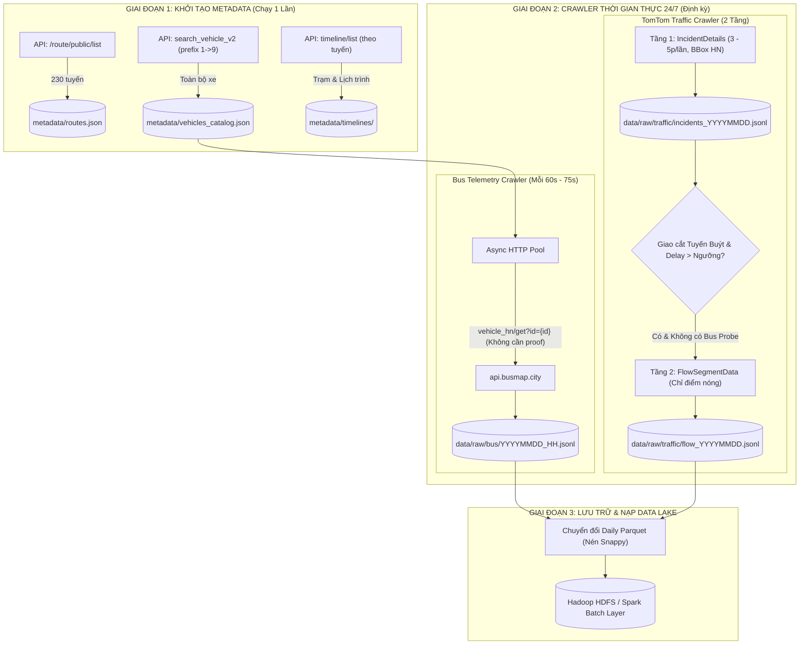

# 08. QUY TRÌNH THU THẬP DỮ LIỆU TOÀN DIỆN (BUS & TOMTOM CRAWLING PIPELINE)

Tài liệu này chuẩn hóa toàn bộ quy trình các bước từ thời điểm hiện tại để nhóm triển khai thu thập dữ liệu tự động, ổn định, không bị chặn và kiểm soát chặt chẽ ngân sách tài nguyên (TomTom Quota < 2.500 req/ngày).

---

## 1. Sơ Đồ Kiến Trúc Đường Ống Thu Thập (End-to-End Crawler Flow)



---

## 2. Quy Trình 3 Bước Thực Thi Chi Tiết

### Bước 1: Khởi Tạo Kho Dữ Liệu Tĩnh (Metadata Ingestion - Chạy 1 lần)
Mục tiêu: Xây dựng bộ "Từ điển dữ liệu" chuẩn xác 100% của toàn mạng lưới Hà Nội.

1. **Quét toàn bộ 230 tuyến xe buýt:**
   - **Endpoint:** `GET https://api.busmap.city/v2/route/public/list?regionCode=hn`
   - **Số request:** Đúng **1 request duy nhất**.
   - **Lưu trữ:** Lưu vào file `data/metadata/routes.json`.
   - **Ý nghĩa:** Có danh sách đầy đủ `routeId`, `routeNo`, `routeName`, `routeType`.

2. **Quét toàn bộ danh bạ xe buýt thành phố (Duyệt tiền tố `1 -> 9`):**
   - **Endpoint:** `GET https://api.busmap.city/v2/public/busmap/search_vehicle_v2?regionCode=hn&limit=100&vehicleId={p}&page={page}`
   - **Cách chạy:** Cho vòng lặp `p` chạy từ `1` đến `9`. Với mỗi `p`, lặp `page = 0, 1, 2...` cho đến khi kết quả rỗng.
   - **Số request:** Chỉ khoảng **50 – 80 requests** (chạy trong 1–2 phút).
   - **Lưu trữ:** Lưu vào file `data/metadata/vehicles_catalog.json`.
   - **Ý nghĩa:** Gom được 100% danh mục các xe đang đăng ký ở Hà Nội gồm: `Id` nội bộ, biển số (`title`), và tuyến được gán (`routeId`).

3. **Tải thứ tự trạm dừng và biểu đồ giờ của các tuyến mục tiêu:**
   - **Endpoint:** `GET https://api.busmap.city/v2/route/public/timeline/list?regionCode=hn&routeId={routeId}`
   - **Cách chạy:** Gọi cho các tuyến trọng điểm (hoặc toàn bộ 230 tuyến, mỗi request cách nhau 500ms).
   - **Lưu trữ:** Lưu vào thư mục `data/metadata/timelines/route_{routeId}.json`.
   - **Ý nghĩa:** Có sẵn thứ tự dừng đỗ từ đầu đến cuối tuyến (`stationOrder`) và giờ xuất bến kế hoạch ban đầu (`timeTableOut`).

---

### Bước 2: Thiết Lập Crawler Dữ Liệu GPS Xe Buýt 24/7 (Bus Telemetry Worker)

Mục tiêu: Thu thập liên tục tọa độ, tốc độ tức thời và trạng thái dừng đỗ mà không lo bị chặn IP hay hết hạn token.

1. **Endpoint khai thác:**
   - Sử dụng endpoint **không cần chữ ký**:
     `GET https://api.busmap.city/v2/public/busmap/vehicle_hn/get?id={vehicle_id}`
   *(Đã kiểm chứng trong `test.py` hoạt động 100% ổn định).*

2. **Chiến lược phân luồng & Tần suất truy vấn:**
   - **Cách 1: Thu thập toàn bộ thành phố (~1.000 xe):**
     - Chu kỳ quét: 75 giây/lần.
     - Tốc độ: $\frac{1.000\text{ xe}}{75\text{ giây}} \approx 13\text{ req/giây}$.
     - Sử dụng thư viện `httpx` hoặc `aiohttp` bất đồng bộ (AsyncIO) có Connection Pool.
   - **Cách 2 (Khuyên dùng cho giai đoạn đầu đồ án - Tinh gọn & An toàn):**
     - Chọn ra **10 tuyến trọng điểm** (ví dụ: Tuyến 01, 02, 08, 28, 32, 27, 54, 101102...).
     - Lọc trong `vehicles_catalog.json` ra danh sách các xe thuộc 10 tuyến này (~120 – 150 xe).
     - Tốc độ: Chỉ cần **2 requests/giây** (hoàn toàn lịch sự, siêu nhẹ nhàng).

3. **Định dạng lưu trữ nhật ký GPS thô (JSON Lines):**
   - Mỗi phản hồi được ghi nối tiếp (`append`) vào file theo định dạng JSON Lines:
     `data/raw/bus/telemetry_YYYY-MM-DD_HH.jsonl`
   - Ví dụ bản ghi:
     ```json
     {"id": 8831234, "plate": "29H93510", "route": 101102, "lat": 21.0037, "lng": 105.8147, "speed": 0, "deg": 0, "ts": "2026-10-07T22:15:00+07:00"}
     ```

---

### Bước 3: Thiết Lập Crawler Giao Thông TomTom 2 Tầng (Traffic Ingestion Worker)

Mục tiêu: Bắt trọn các điểm tắc nghẽn toàn thành phố nhưng kiểm soát lượng request luôn dưới hạn mức **2.500 requests/ngày** của gói Free.

#### Quy trình Tầng 1: Quét Nông Diện Rộng (Macro Incident Scan)
1. **Endpoint:**
   `https://api.tomtom.com/traffic/services/5/incidentDetails?key={KEY}&bbox=105.703949,20.933177,106.011921,21.252462&fields={incidents{type,geometry{type,coordinates},properties{magnitudeOfDelay,delay,length}}}`
   *(Sử dụng đúng tọa độ BBox chuẩn Hà Nội trích xuất từ `map_raw.txt`).*
2. **Lập lịch phân bổ theo giờ:**
   - **Cao điểm sáng (06:30 – 09:00):** Chạy **3 phút/lần** (50 requests).
   - **Cao điểm chiều (16:30 – 19:30):** Chạy **3 phút/lần** (60 requests).
   - **Ban ngày bình thường (09:00 – 16:30, 19:30 – 22:00):** Chạy **5 phút/lần** (~110 requests).
   - **Đêm (22:00 – 05:00):** Tạm dừng.
   - $\implies$ **Tổng số request Tầng 1 chỉ tốn đúng ~220 requests/ngày!**
3. **Lưu trữ:** Ghi vào `data/raw/traffic/incidents_YYYY-MM-DD.jsonl`.

#### Quy trình Tầng 2: Khoan Sâu Điểm Nóng (Micro Flow Query)
1. **Lọc không gian:**
   - Lấy danh sách các vụ tắc đường từ Tầng 1.
   - Chỉ giữ lại các vụ tắc có tọa độ nằm trong bán kính $30\text{m}$ của các tuyến buýt đang theo dõi.
   - Điều kiện kích hoạt: $\text{delay / length} \ge 0.5\text{ s/m}$ (tắc nghẽn nghiêm trọng).
2. **Ưu tiên Bus-as-a-Probe (Không tốn request):**
   - Kiểm tra xem trong 5 phút qua có xe buýt nào vừa đi qua đoạn đó không. Nếu có xe vừa đi với tốc độ $< 10\text{ km/h}$, sử dụng luôn tốc độ xe buýt $\to$ **Không cần gọi TomTom**.
3. **Gọi TomTom Flow khi cần thiết:**
   - Nếu phía trước là "khoảng trống" chưa có xe buýt nào đi tới: Gọi `flowSegmentData` tại tọa độ điểm tắc.
   - Giới hạn cứng (Circuit Breaker): Đặt trần tối đa **1.800 requests/ngày**. Nếu đạt 1.800 req thì dừng Tầng 2, fallback về dữ liệu lịch sử của Spark Batch.

---

## 4. Kế Hoạch Chuyển Đổi Dữ Liệu Hàng Ngày Sang Data Lake (Batch Staging)

Mỗi ngày vào lúc **00:30 đêm**, một cron script tự động chạy:
1. Đọc toàn bộ file `.jsonl` phát sinh trong ngày của cả xe buýt và giao thông.
2. Làm sạch (loại bỏ ping trùng lặp, lọc tọa độ ngoại lai).
3. Đóng gói thành định dạng cột **Apache Parquet (nén Snappy)**:
   `data/datalake/year=YYYY/month=MM/day=DD/bus_telemetry.parquet`
4. Đây chính là kho dữ liệu Master Data nạp vào Hadoop HDFS để Spark Batch tính toán ma trận vận tốc lịch sử (`Speed Profiles`).

---

## 5. Danh Mục Công Việc Hành Động Ngay Hôm Nay (Immediate Action Checklist)

| STT | Công việc | File thực hiện | Trạng thái |
| :---: | :--- | :--- | :---: |
| 1 | Tạo cấu trúc thư mục lưu trữ dữ liệu `data/` | `mkdir -p data/{metadata,raw/bus,raw/traffic}` | Cần làm ngay |
| 2 | Chạy script tạo Master Routes và Master Vehicles | `scripts/init_master_metadata.py` | Cần làm ngay |
| 3 | Chạy Daemon Worker thu thập GPS xe buýt chạy ngầm | `scripts/crawler_bus.py` | Cần làm ngay |
| 4 | Chạy Daemon Worker thu thập TomTom 2 tầng theo lịch | `scripts/crawler_tomtom.py` | Cần làm ngay |

