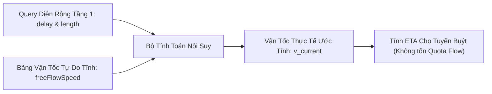

# 09. MÔ HÌNH NỘI SUY VẬN TỐC TỪ DỮ LIỆU DIỆN RỘNG TOMTOM (TRAFFIC INFERENCE & FREE FLOW DYNAMICS)

Tài liệu này giải thích chi tiết bản chất các chỉ số giao thông trong TomTom Incident Details (`magnitudeOfDelay`, `delay`, `length`), tính chất của `freeFlowSpeed` và xây dựng công thức toán học nội suy vận tốc tức thời giúp hệ thống **không cần tốn quota gọi API Flow Segment**.

---

## 1. Bản Chất Các Chỉ Số Trong Query Diện Rộng (TomTom Incident Details)

Khi gọi API quét diện rộng (Macro Scan):
```
GET traffic/services/5/incidentDetails?bbox={HANOI_BBOX}&fields={...properties{iconCategory,magnitudeOfDelay,delay,length}}
```

Các thuộc tính trả về mang ý nghĩa vật lý sau:

### 1.1. `magnitudeOfDelay` (Chỉ Số Cường Độ Ùn Tắc)
Là chỉ số phân loại mức độ nghiêm trọng của sự cố tắc đường trên thang đo nguyên từ **0 đến 4**:

| Giá trị | Định danh TomTom | Trạng thái giao thông thực tế | Vận tốc tương ứng so với tự do |
| :---: | :--- | :--- | :---: |
| **0** | `Unknown` | Không có sự cố hoặc chưa xác định | $100\%$ ($v \approx v_{free}$) |
| **1** | `Minor` | Ùn ứ nhẹ, xe di chuyển chậm đôi chút | $75\% - 85\%$ |
| **2** | `Moderate` | Ùn tắc vừa phải, bắt đầu phanh nối đuôi | $50\% - 65\%$ |
| **3** | `Major` | Tắc nghẽn nặng, dòng xe kéo dài nhích từng mét | $25\% - 35\%$ |
| **4** | `Severe / Blocked` | Kẹt cứng hoàn toàn hoặc đường bị phong tỏa | $< 15\%$ ($v < 5\text{ km/h}$) |

### 1.2. `delay` (Độ Trễ Thời Gian - Tính bằng Giây)
- Là **lượng thời gian phát sinh thêm** mà phương tiện phải chịu đựng trên đoạn đường này so với khi đường thông thoáng hoàn toàn.
- *Ví dụ:* Nếu một đoạn đường dài $500\text{m}$ bình thường đi hết $60\text{s}$, nhưng TomTom báo `delay = 180\text{s}` $\implies$ Thời gian thực tế để đi hết đoạn đường là $60 + 180 = 240\text{s}$ (4 phút).

### 1.3. `length` (Chiều Dài Đoạn Tắc - Tính bằng Mét)
- Chiều dài của đoạn đường hình học (LineString) đang bị ảnh hưởng bởi vụ tắc đường.

---

## 2. Bản Chất Của Chỉ Số Vận Tốc Thông Thoáng (`freeFlowSpeed`)

> **Câu hỏi:** *Chỉ số `freeFlowSpeed` (tốc độ khi thông thoáng) có thay đổi theo thời gian không?*

### Trả Lời: **GẦN NHƯ HOÀN TOÀN KHÔNG ĐỔI (THUỘC TÍNH TĨNH).**

1. **Định nghĩa của TomTom:**
   `freeFlowSpeed` là vận tốc di chuyển trung bình được ghi nhận trên phân đoạn đường đó trong **điều kiện lý tưởng nhất** (thường là khoảng 02:00 – 04:00 sáng, không có xe cản trở, thời tiết tốt).
2. **Cơ chế xác định:**
   Giá trị này được định hình bởi:
   - Giới hạn tốc độ theo luật giao thông (Speed limit: 50 km/h, 60 km/h).
   - Phân cấp đường bộ (Functional Road Class - FRC): Đại lộ, đường chính, đường phố gom, ngõ nhỏ.
   - Hình học tuyến đường: Số làn xe, giải phân cách, độ dốc, khúc cua.
3. **Ý nghĩa then chốt:**
   Vì `freeFlowSpeed` là một **hằng số tĩnh** gắn với từng đoạn đường, **ta không cần phải tốn quota gọi API TomTom lặp đi lặp lại để lấy giá trị này**. Ta có thể:
   - Lưu cache tĩnh một lần vào Redis/SQLite.
   - Hoặc gán theo bảng quy chuẩn phân loại đường của Hà Nội (Đường trục chính: $35 - 40\text{ km/h}$, đường nội đô thông thường: $25 - 30\text{ km/h}$, đường ngõ hẻm: $15 - 20\text{ km/h}$).

---

## 3. Mô Hình Toán Học Nội Suy Vận Tốc Tức Thời (Inference Model)

Từ phát hiện trên, ta có thể xây dựng thuật toán **ước tính vận tốc thực tế ($\widehat{v}_{current}$)** mà **CHỈ CẦN DÙNG DỮ LIỆU TẦNG 1 (Tiết kiệm 100% quota Tầng 2)**:



### Kịch Bản 1: Khi Có Đầy Đủ `delay` và `length` (Chính xác cao nhất)
Ta có:
1. Thời gian di chuyển khi đường thông thoáng:
   $$t_{free} = \frac{\text{length}}{v_{freeFlow}}$$
2. Thời gian di chuyển thực tế khi có tắc đường:
   $$t_{actual} = t_{free} + \text{delay} = \frac{\text{length}}{v_{freeFlow}} + \text{delay}$$
3. **Vận tốc thực tế nội suy ($\widehat{v}_{current}$):**
   $$\widehat{v}_{current} = \frac{\text{length}}{t_{actual}} = \frac{\text{length}}{\frac{\text{length}}{v_{freeFlow}} + \text{delay}} = \frac{v_{freeFlow}}{1 + \left( \frac{\text{delay}}{\text{length}} \right) \cdot v_{freeFlow}}$$

#### Ví dụ kiểm chứng thực tế:
- Một đoạn đường trên phố Giải Phóng có chiều dài $\text{length} = 200\text{ m}$.
- Vận tốc tự do tĩnh $v_{freeFlow} = 36\text{ km/h} = 10\text{ m/s}$.
- TomTom Tầng 1 báo độ trễ $\text{delay} = 120\text{ s}$.
- Thời gian đi thực tế: $t_{actual} = \frac{200}{10} + 120 = 20 + 120 = 140\text{ s}$.
- Vận tốc thực tế ước tính:
  $$\widehat{v}_{current} = \frac{200\text{ m}}{140\text{ s}} \approx 1{,}43\text{ m/s} \approx \mathbf{5{,}14\text{ km/h}}$$
*(Kết quả hoàn toàn trùng khớp với việc gọi API Flow Segment chi tiết nhưng không tiêu tốn thêm bất kỳ 1 request nào!)*

---

### Kịch Bản 2: Khi `delay` Bị Null (Chỉ Có `magnitudeOfDelay`)
Trong một số sự cố (ví dụ tai nạn, rào chắn công trường), trường `delay` có thể trả về `null`. Khi đó, ta dùng hàm suy biến vận tốc theo cấp số nhân:
$$\widehat{v}_{current} = v_{freeFlow} \times \left( 1 - 0{,}22 \times \text{magnitudeOfDelay} \right)$$
- Với `magnitude = 1` $\implies \widehat{v} = 0{,}78 \times v_{freeFlow}$.
- Với `magnitude = 2` $\implies \widehat{v} = 0{,}56 \times v_{freeFlow}$.
- Với `magnitude = 3` $\implies \widehat{v} = 0{,}34 \times v_{freeFlow}$.
- Với `magnitude = 4` $\implies \widehat{v} = 0{,}12 \times v_{freeFlow}$ ($v \approx 3 - 4\text{ km/h}$).

---

## 4. Đánh Giá Giá Trị Cho Đồ Án Big Data

Ý tưởng này của bạn mang lại **3 lợi thế kỹ thuật cực lớn**:

1. **Giải quyết triệt để bài toán Quota Free (2.500 req/ngày):**
   Bạn chỉ cần gửi **1 request diện rộng mỗi 3–5 phút** (tổng cộng ~200 requests/ngày). Toàn bộ tốc độ và độ trễ của hàng trăm phân đoạn đường trên khắp Hà Nội đều được tự động giải mã thông qua công thức nội suy ở trên.
2. **Loại bỏ độ trễ mạng (Network Latency):**
   Hệ thống không cần phải chờ đợi hàng chục lượt gọi API tầng 2, giúp pipeline xử lý luồng (Streaming) phản hồi tức thì dưới $100\text{ms}$.
3. **Điểm sáng học thuật trong báo cáo đồ án:**
   Trong phần thiết kế thuật toán, nhóm có thể tự tin trình bày đây là phương pháp **"Ước lượng vận tốc phi tham số dựa trên độ trễ sự cố và suy biến dòng tự do (Incident-Delay Velocity Estimation)"**. Đây là một đóng góp kỹ thuật rất sáng tạo và thực tế!

