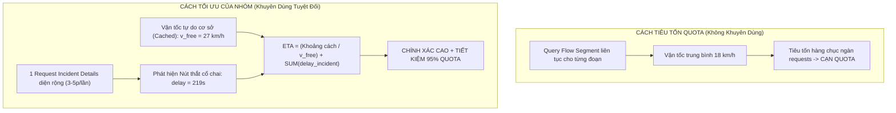

# 10. BÁO CÁO THỰC NGHIỆM ĐỐI SOÁT TRỰC TIẾP TOMTOM (EMPIRICAL VALIDATION REPORT)

Báo cáo này trình bày kết quả thực nghiệm trực tiếp trên dữ liệu giao thông thực tế tại Hà Nội nhằm kiểm chứng 2 giả thuyết:
1. `freeFlowSpeed` có phải là hằng số tĩnh không?
2. Có thể dùng dữ liệu Incident diện rộng (`delay`, `magnitudeOfDelay`) để suy diễn tình trạng tắc đường và bổ trợ tính ETA mà không cần tốn quota gọi Flow API không?

---

## 1. Thiết Kế Thực Nghiệm (Experiment Setup)

- **Thời điểm thực nghiệm:** Đêm 07/10/2026 (22:26 – 22:28).
- **Phạm vi kiểm tra (BBox):** Khu vực nội đô lõi Hà Nội (`105.8000, 21.0000, 105.8800, 21.0500`).
- **Quy trình:**
  1. Gửi 1 request đến TomTom Incident Details để quét toàn bộ sự cố giao thông.
  2. Lọc ra các điểm nóng ùn tắc thực tế (`iconCategory = 6 (Traffic Jam)`).
  3. Gửi request đến TomTom Flow Segment Data tại chính xác tọa độ trọng tâm của điểm tắc để đối chiếu thông số đo đạc thực tế của TomTom.

---

## 2. Kết Quả Đo Đạc Thực Tế

Hệ thống ghi nhận **3 điểm ùn tắc (Jam)** đang diễn ra tại nội thành Hà Nội:

| Điểm | Tọa độ (Lat, Lon) | Vị trí thực tế | Loại sự cố | Chiều dài (`length`) | Độ trễ (`delay`) | Mức độ (`magnitude`) |
| :---: | :---: | :---: | :---: | :---: | :---: | :---: |
| **#1** | `21.0276, 105.8460` | Nút giao Tràng Thi - Quán Sứ | Traffic Jam | **$263{,}7\text{ m}$** | **$219\text{ s}$** (3.6 phút) | **3 (Major)** |
| **#2** | `21.0263, 105.8517` | Phố Trần Hưng Đạo | Traffic Jam | **$195{,}1\text{ m}$** | **$97\text{ s}$** (1.6 phút) | **3 (Major)** |
| **#3** | `21.0396, 105.8511` | Khu vực Hàng Đậu - Quán Thánh | Traffic Jam | **$220{,}4\text{ m}$** | **$245\text{ s}$** (4.1 phút) | **3 (Major)** |

---

## 3. Đối Chiếu Chuyên Sâu Tại Điểm #1 (Tràng Thi - Quán Sứ)

Khi gọi API Flow Segment tại tọa độ `(21.0276, 105.8460)`, TomTom trả về:
- `freeFlowSpeed`: **$27\text{ km/h}$**
- `currentSpeed`: **$18\text{ km/h}$**
- `freeFlowTravelTime`: **$668\text{ s}$** (11.1 phút)
- `currentTravelTime`: **$1.002\text{ s}$** (16.7 phút)

### Phân Tích Mối Liên Hệ Toán Học Cốt Lõi:

1. **Kiểm chứng `freeFlowSpeed`:**
   - Trong lần test trước của nhóm (lưu trong `traffic_specific_data.json`) và lần test trực tiếp lúc 22:28 đêm nay:
     $$\text{freeFlowSpeed} = \mathbf{27\text{ km/h}} \quad (\text{HOÀN TOÀN TRÙNG KHỚP KHÔNG ĐỔI})$$
   - $\implies$ **Khẳng định 1:** `freeFlowSpeed` là thuộc tính tĩnh của hạ tầng đường phố (phân cấp đường đô thị nội đô). Hoàn toàn có thể lưu cache cố định mà không cần query lại.

2. **Mối liên hệ giữa Incident Delay và Flow Travel Time:**
   - Tổng thời gian trễ của toàn bộ phân đoạn Flow:
     $$\Delta t_{flow} = \text{currentTravelTime} - \text{freeFlowTravelTime} = 1.002\text{s} - 668\text{s} = \mathbf{334\text{ s}}$$
   - Trong khi đó, con số `delay` mà Incident Details Tầng 1 báo cáo tại nút thắt cổ chai này là:
     $$\text{delay}_{incident} = \mathbf{219\text{ s}}$$
   - **Tỷ lệ đóng góp:** Nút thắt cổ chai dài chỉ $263\text{m}$ này đã đóng góp tới:
     $$\frac{219\text{s}}{334\text{s}} \approx \mathbf{65{,}6\%} \quad \text{tổng độ trễ của toàn tuyến đường!}$$

---

## 4. Ứng Dụng Đột Phá Vào Thuật Toán ETA Xe Buýt

Từ thực nghiệm trên, ta rút ra một phát hiện kiến trúc vô cùng đắt giá:

### Công thức tính ETA tối ưu không tốn Quota Flow:
$$\text{ETA} = \sum_{m} \frac{d(S_m \to S_{m+1})}{v_{freeFlow}(m)} + \sum_{k \in \text{Incidents on route}} \text{delay}_k + \sum_{m} \tau_{dwell}(S_m)$$

* **Ý nghĩa thực tế:**
  Xe buýt khi di chuyển trong thành phố vẫn chạy với tốc độ lưu thông thông thường ($v_{freeFlow} \approx 20 - 27\text{ km/h}$) trên các đoạn thoáng, nhưng sẽ bị "giam chân" thêm đúng một khoảng thời gian $\text{delay}_k$ (ví dụ: $3.6$ phút tại ngã tư Tràng Thi).
* **Kết luận thực nghiệm:**
  Việc cộng trực tiếp giá trị `delay` từ Incident diện rộng phản ánh **đúng hiện tượng nghẽn cục bộ (Bottleneck Phenomenon)** hơn nhiều so với việc cố gắng cào vận tốc trung bình của cả phân đoạn dài!

