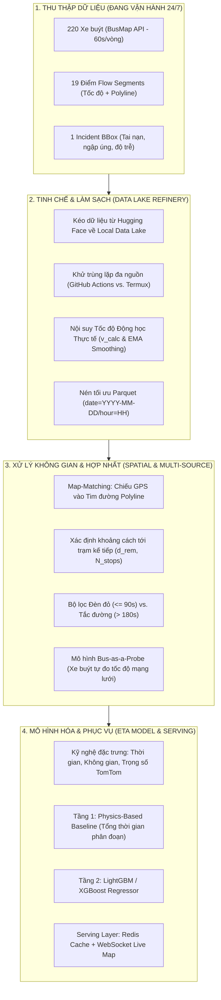

# 20. LỘ TRÌNH VÀ THIẾT KẾ XỬ LÝ DỮ LIỆU & MÔ HÌNH HÓA ETA (DATA PROCESSING & ETA PIPELINE ROADMAP)

> **Ghi chú phân kỳ:** Tài liệu này chuẩn hóa toàn bộ thiết kế kiến trúc, công thức toán học và quy trình xử lý dữ liệu để triển khai sau khi hoàn tất giai đoạn tích lũy dữ liệu cào (Crawl Phase).

---

## 1. Tổng Quan Kiến Trúc Xử Lý Đa Nguồn (System Overview)

Dữ liệu thô thu thập 24/7 từ 220 xe buýt và 19 điểm nút giao TomTom (kèm Incident BBox) được xử lý qua 4 giai đoạn khép kín:

---

## 2. Tiền Xử Lý: Nội Suy Tốc Độ Động Học Thực Tế (Kinematic Velocity Interpolation)

### 2.1. Rào cản của trường `Speed` từ BusMap API:
- Thiết bị GPS (hộp đen) chỉ gửi dữ liệu mỗi 30–60s. Vận tốc `Speed` của API chỉ là vận tốc tức thời tại đúng thời điểm phát gói tin. Khi xe phanh dừng đón khách hoặc dừng đèn đỏ, `Speed = 0` dù cả phút trước xe di chuyển bình thường.
- Hiện tượng treo cảm biến dẫn đến vận tốc rác (`0`, `-1` hoặc giá trị đứng im).

### 2.2. Công thức Nội suy Tốc độ Hành trình ($v_{calc}$):
Sử dụng 2 ping liên tiếp của cùng một xe $v$ tại thời điểm $t_{prev}$ và $t_{curr}$:

$$d = \text{Haversine}(lat_{t-1}, lon_{t-1}, lat_t, lon_t) \quad (\text{mét})$$
$$\Delta t = t_{curr} - t_{prev} \quad (\text{giây})$$
$$v_{calc} = \frac{d}{\Delta t} \times 3.6 \quad (\text{km/h})$$

### 2.3. Bộ lọc Làm mịn Số mũ (EMA Filter):
Để loại bỏ nhiễu rung sai số vệ tinh:
$$v_{smoothed}(t) = \gamma \cdot v_{calc}(t) + (1 - \gamma) \cdot v_{smoothed}(t-1) \quad (\text{với } \gamma = 0.65)$$

---

## 3. Quy Tắc Nghiệp Vụ Thực Tế Tại Hà Nội

### 3.1. Phân biệt Dừng Đèn Đỏ vs. Tắc Đường Thực Sự:
- **Chờ Đèn Đỏ (`TRAFFIC_LIGHT_WAIT`)**: Vị trí xe nằm trong bán kính 60m trước vạch dừng ngã tư, $v_{calc} \approx 0$ và thời gian dừng $\le 90$ giây.
- **Ùn Tắc (`CONGESTION_JAM`)**: Xe dừng hoặc bò nhích ($v_{calc} < 5\text{ km/h}$) kéo dài $> 180$ giây (quá 2 nhịp đèn tín hiệu) hoặc trải dài liên tục $> 200\text{m}$.

### 3.2. Vùng Che Khuất GPS (GPS Multipath & Dead Zones):
- **Hầm Kim Liên** (Tuyến 26, 32): Tự động phát hiện khi xe vào hầm, giữ nguyên vận tốc ước lượng gần nhất (`Dead Reckoning`).
- **Gầm cầu cạn Vành đai 2** (Trường Chinh - Minh Khai): Sóng GPS bị dội bê tông, áp dụng thuật toán chiếu hình học vuông góc bắt dính về tim đường (Snap-to-road).

### 3.3. Nhận diện Xe Chạy Tránh Tuyến (Detour Detection):
- Khi có phân luồng thi công hoặc cấm đường, nếu khoảng cách vuông góc từ xe tới tim đường tuyến $> 250\text{m}$ trong 3 ping liên tiếp:
  - Gắn nhãn `DETOUR_ACTIVE`.
  - Loại bỏ các ping này khỏi tập huấn luyện ETA của lộ trình chuẩn để tránh làm nhiễu dữ liệu lịch sử.

---

## 4. Công Thức Toán Học Dự Đoán ETA Hợp Nhất (Comprehensive ETA Formulation)

Thời gian dự kiến xe buýt $v$ đến trạm đích $S_k$ tại thời điểm $t_{now}$:

$$\text{ETA}(v, S_k, t_{now}) = \Delta t_{current\_seg} + \sum_{m = i+1}^{k-1} \Delta t_{travel}(S_m \to S_{m+1}) + \sum_{m = i}^{k-1} \tau_{dwell}(S_m)$$

*Trong đó:*
1. **$\Delta t_{current\_seg}$**: Thời gian chạy hết đoạn đường dở dang hiện tại:
   $$\Delta t_{current\_seg} = \frac{d_{remaining}(v, S_i)}{v_{smoothed}(v)}$$
2. **$\Delta t_{travel}(S_m \to S_{m+1})$**: Thời gian qua các phân đoạn tiếp theo, hợp nhất 3 nguồn vận tốc:
   $$v_{segment} = w_1 \cdot \bar{v}_{historical} + w_2 \cdot v_{probe\_bus} + w_3 \cdot v_{tomtom}$$
   *(Ưu tiên $v_{probe\_bus}$ cao nhất nếu có xe buýt đi trước trong vòng 8 phút; nếu không có xe trước thì dùng $v_{tomtom}$; nếu không có điểm nghẽn TomTom thì dùng $\bar{v}_{historical}$).*
3. **$\tau_{dwell}(S_m)$**: Thời gian dừng đón trả khách lịch sử tại trạm $S_m$ theo khung giờ 15 phút.

---

## 5. Quy Trình Phân Kỳ Triển Khai (Post-Ingestion Execution Plan)

1. **Tuần hoàn tất Crawl**: Kéo toàn bộ dataset từ Hugging Face về qua script đồng bộ; chạy Deduplication và chuyển đổi sang Master Parquet Lake.
2. **Tuần GIS & Stop Matching**: Trích xuất tọa độ trạm dừng và Polyline chuẩn cho 19 tuyến; chạy Map-matching cho toàn bộ kho pings.
3. **Tuần Huấn Luyện Mô Hình**:
   - Xây dựng mô hình Baseline (Vật lý - Segment Speed Sum).
   - Huấn luyện LightGBM Regressor dự đoán sai số thời gian chạy ($\Delta t$).
   - Đánh giá chỉ số MAE, RMSE so với thực nghiệm (kỳ vọng MAE $\le 1.5 - 2.0$ phút).
4. **Tuần Trực Quan Hóa**: Đóng gói FastAPI + bản đồ Leaflet theo dõi thời gian thực.

