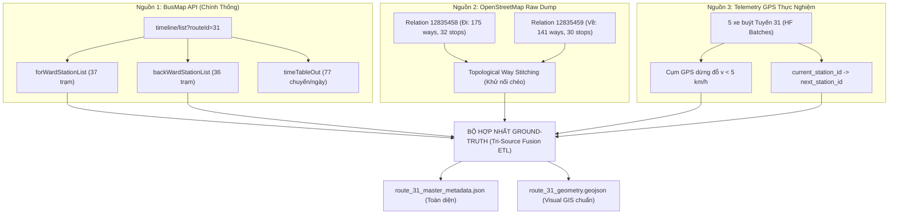

# 26. ĐẶC TẢ KỸ THUẬT: TRÍCH XUẤT HÌNH HỌC TUYẾN & TỌA ĐỘ TRẠM DỪNG GROUND-TRUTH (TUYẾN 31 DEMO)

> **Trạng thái:** BẢN THIẾT KẾ & ĐẶC TẢ THI CÔNG CHUẨN XÁC  
> **Mục tiêu:** Xây dựng bộ siêu dữ liệu chuẩn hóa (Master Metadata & Continuous Polyline) cho Tuyến 31 (Bách Khoa ↔ Chèm), loại bỏ 100% việc đoán mò tọa độ và triệt tiêu hoàn toàn lỗi nối chéo polyline (Criss-Cross Artifacts).

---

## 1. Bối Cảnh & Các Rủi Ro Kỹ Thuật Cần Triệt Tiêu

### 1.1. Thực Trạng Dữ Liệu
Để phục vụ mô hình ETA và Map-matching, hệ thống cần 3 thành phần cốt lõi:
1. **Danh sách trạm dừng thứ tự chuẩn:** Đã có từ BusMap `timeline/list` (37 trạm chiều đi, 36 trạm chiều về), nhưng BusMap **không trả về `lat, lon`** qua API public (nằm trong file SQLite cục bộ).
2. **Hình học cung đường (Shape Polyline):** OpenStreetMap (OSM) chứa toàn bộ các đoạn đường (`ways`) thực tế của Tuyến 31 qua 2 relation chính thức:
   - Chiều đi (Outbound): Relation OSM `12835458` (*Đại học Bách Khoa $\to$ Chèm*).
   - Chiều về (Inbound): Relation OSM `12835459` (*Chèm $\to$ Đại học Bách Khoa*).
3. **Định vị thực địa (Physical GPS Probes):** Telemetry thu thập thực tế từ 5 xe buýt Tuyến 31 (`8831601`, `8831400`, `8831395`, `232555`, `232558`) đang lưu thông và dừng đón khách tại các trạm.

### 1.2. Hai Cạm Bẫy Kỹ Thuật Phải Tránh Tuyệt Đối
1. **Lỗi phụ thuộc mạng Overpass (Lỗi Rate-limit / Timeout 504):**
   - *Nguyên nhân:* Gọi Overpass API liên tục trong quá trình xử lý ETL dễ bị quá tải hoặc chặn IP.
   - *Giải pháp:* Tải một lần toàn bộ bản thô không cắt (**Uncut Raw Dump**) và lưu vĩnh viễn vào file cục bộ [`data/metadata/osm_route_31_raw.json`](file:///z:/Desktop/Bus_tracking/data/metadata/osm_route_31_raw.json). Mọi bước xử lý sau này chỉ đọc từ file local này.
2. **Lỗi đường bị nối chéo (Criss-Cross / Diagonal Jumping Lines):**
   - *Nguyên nhân:* 
     * Dùng Bounding Box cắt ngang các đoạn đường làm đứt gãy quan hệ.
     * Nối các điểm `ways` theo thứ tự ngẫu nhiên của ID hoặc nối sai chiều ngược lại của đường 1 chiều/2 chiều.
   - *Giải pháp:* Truy vấn theo ID Relation nguyên bản (không dùng BBox cắt), sau đó áp dụng **Thuật toán Duyệt Đồ thị Nối liên tục (Topological Directed Stitching Algorithm)** để đảo chiều các node của way nếu bị ngược, ghép thành một đường LineString duy nhất mượt mà, liên tục theo đúng chiều di chuyển của xe.

---

## 2. Kiến Trúc Hợp Nhất 3 Nguồn Dữ Liệu (Tri-Source Fusion)



---

## 3. Thuật Toán Khử Nối Chéo & Nối Ghép Polyline Liên Tục (Topological Stitching)

### 3.1. Nguyên Lý Kỹ Thuật
Trong OSM, một quan hệ `route=bus` chứa danh sách các `way`. Mỗi way gồm chuỗi node:
$$W_i = [n_{i,1}, n_{i,2}, \dots, n_{i,m}]$$

Các way trong OSM thường bị phân mảnh do ngã tư, biển báo giao thông hoặc có thể bị số hóa ngược chiều vector:
- Nếu $n_{i,m} == n_{i+1,1}$: Hai way nối tiếp hoàn hảo $\to$ Ghép thẳng.
- Nếu $n_{i,m} == n_{i+1,k}$: Way tiếp theo bị ngược chiều $\to$ Đảo ngược mảng $W_{i+1}$ rồi mới ghép.
- Nếu có khe hở nhỏ do nút giao bùng binh (Roundabout) hoặc điểm trung chuyển: Tìm way tiếp theo có khoảng cách Euclid đầu cuối nhỏ nhất ($< 25\text{m}$) để kết nối, **tuyệt đối không nhảy cóc qua nửa thành phố gây đường nối chéo**.

### 3.2. Thuật Toán Ghép Đường
```python
def stitch_ways_topologically(way_list, nodes_dict):
    """
    Đầu vào: Danh sách ways theo thứ tự thành viên trong Relation OSM.
    Đầu ra: Chuỗi tọa độ liên tục [[lon, lat], ...] không có đường chéo cắt ngang.
    """
    # 1. Chuyển đổi từng way thành mảng tọa độ
    # 2. Bắt đầu từ Way đầu tiên (đầu bến)
    # 3. Với mỗi way kế tiếp:
    #    - Kiểm tra hướng trùng khớp giữa điểm cuối current_polyline và 2 đầu của way mới
    #    - Nếu đảo chiều giảm sai số khoảng cách -> Đảo ngược thứ tự node của way mới
    #    - Ghép nối liên tục
```

---

## 4. Đặc Tả Cấu Trúc File Đầu Ra (Data Schemas)

### 4.1. File 1: `data/metadata/osm_route_31_raw.json`
- Chứa nguyên vẹn dữ liệu JSON xuất từ Overpass cho 2 quan hệ `12835458` và `12835459`.
- Lưu trữ cục bộ vĩnh viễn, không bao giờ phải tải lại.

### 4.2. File 2: `data/metadata/route_31_master_metadata.json`
File siêu dữ liệu trung tâm phục vụ trực tiếp cho toàn bộ đường ống ML & Map-Matching:
```json
{
  "route_id": 31,
  "route_no": "31",
  "route_name": "Bách Khoa - Chèm (ĐH Mỏ)",
  "outbound": {
    "direction_id": 0,
    "from_terminus": "Đại học Bách Khoa",
    "to_terminus": "Chèm (Đại học Mỏ)",
    "total_distance_meters": 18450.5,
    "total_stations": 37,
    "polyline_coordinates": [
      [105.845268, 21.006611],
      [105.845500, 21.006800]
    ],
    "stations": [
      {
        "station_order": 0,
        "station_id": 1707,
        "station_name": "(A) Đại học Bách Khoa",
        "lat": 21.006611,
        "lon": 105.845268,
        "distance_along_route_m": 0.0,
        "osm_node_id": 8766627165,
        "timetable_dispatch": "18000,18900,19800,..."
      },
      {
        "station_order": 1,
        "station_id": 342,
        "station_name": "Sân vận động Bách Khoa, Lê Thanh Nghị",
        "lat": 21.004150,
        "lon": 105.847520,
        "distance_along_route_m": 420.5,
        "osm_node_id": 738813884,
        "timetable_dispatch": ""
      }
    ]
  },
  "inbound": {
    "direction_id": 1,
    "from_terminus": "Chèm (Đại học Mỏ)",
    "to_terminus": "Đại học Bách Khoa",
    "total_distance_meters": 18120.0,
    "total_stations": 36,
    "polyline_coordinates": [...],
    "stations": [...]
  }
}
```

### 4.3. File 3: `data/metadata/route_31_geometry.geojson`
Định dạng chuẩn GeoJSON FeatureCollection để mở xem trực quan trên:
- **QGIS / ArcGIS**
- **geojson.io** hoặc **Kepler.gl**
- Tự động hiển thị bản đồ trực tiếp trên GitHub:
  - Feature 1: `LineString` (Cung đường chiều đi)
  - Feature 2: `LineString` (Cung đường chiều về)
  - Features 3..N: `Point` (37 trạm dừng chiều đi và 36 trạm dừng chiều về với đầy đủ nhãn tên trạm)

---

## 5. Kế Hoạch Triển Khai Chi Tiết (Execution Plan)

- [ ] **Bước 1: Tải Bản Thô Không Cắt (Offline Raw OSM Dump):**
  - Viết module tải đầy đủ quan hệ `12835458` và `12835459` không sử dụng Bounding Box cắt gọt.
  - Lưu vào [`data/metadata/osm_route_31_raw.json`](file:///z:/Desktop/Bus_tracking/data/metadata/osm_route_31_raw.json).
- [ ] **Bước 2: Xây Dựng Thuật Toán Nối Polyline Topological:**
  - Sắp xếp và đảo chiều các `way` để tạo thành LineString phẳng, liên tục, kiểm tra khoảng cách bước nhảy tối đa giữa 2 way kế tiếp ($< 30\text{m}$).
- [ ] **Bước 3: Chiếu Tọa Độ Trạm Dừng Lên Tuyến:**
  - Kết hợp tọa độ trạm OSM, tọa độ dừng đỗ thực tế từ 5 xe telemetry, và danh sách 37 trạm của BusMap.
  - Tính khoảng cách lũy kế dọc tuyến ($s_k \in [0, L_{total}]$) cho từng trạm.
- [ ] **Bước 4: Xuất Master JSON & GeoJSON Kiểm Chứng:**
  - Tạo [`data/metadata/route_31_master_metadata.json`](file:///z:/Desktop/Bus_tracking/data/metadata/route_31_master_metadata.json) và [`data/metadata/route_31_geometry.geojson`](file:///z:/Desktop/Bus_tracking/data/metadata/route_31_geometry.geojson).
  - Kiểm tra trực quan bằng script kiểm thử để đảm bảo 0% đường chéo nhảy cóc.

