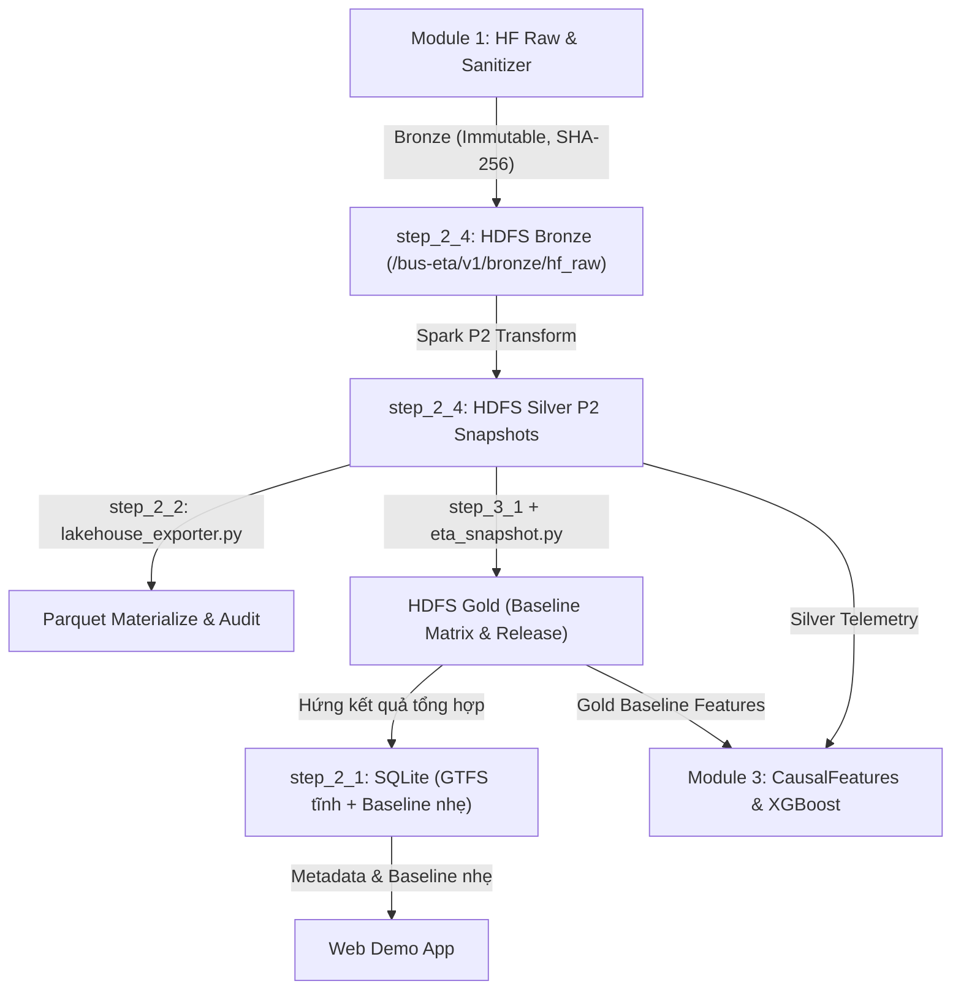

# Module 2: Lưu trữ Dữ liệu & Medallion Lakehouse (`module_2_big_data_storage_and_lakehouse`)

- **Vai trò:** Quản lý kho lưu trữ lịch sử chính trên **HDFS (Bronze – Silver – Gold)** — mọi dữ liệu thu thập đều đi qua HDFS; giữ **SQLite** làm nền nhẹ cho Web App (GTFS chuẩn + hứng kết quả tổng hợp từ HDFS Gold).
- **Đầu vào:** Hugging Face Raw Batches (`Toibinguz/hust-bus-data`) & dữ liệu GTFS chuẩn (`step_1_5`).
- **Đầu ra:** HDFS Bronze/Silver/Gold (`step_2_4_hdfs_history/`), Parquet phân vùng (`step_2_2/`), và SQLite nền nhẹ (`data/hanoi_bus_system.db`) cho Web App.

## Sơ đồ Luồng Dữ liệu (Data Flow)

```mermaid
flowchart TD
    M1["Module 1: HF Raw & Sanitizer"] -->|"Bronze (Immutable, SHA-256)"| S24B["step_2_4: HDFS Bronze (/bus-eta/v1/bronze/hf_raw)"]
    S24B -->|"Spark P2 Transform"| S24S["step_2_4: HDFS Silver P2 Snapshots"]
    S24S -->|"step_2_2: lakehouse_exporter.py"| S22["Parquet Materialize & Audit"]
    S24S -->|"step_3_1 + eta_snapshot.py"| GOLD["HDFS Gold (Baseline Matrix & Release)"]
    GOLD -->|"Hứng kết quả tổng hợp"| S21["step_2_1: SQLite (GTFS tĩnh + Baseline nhẹ)"]
    S24S -->|"Silver Telemetry"| M3["Module 3: CausalFeatures & XGBoost"]
    GOLD -->|"Gold Baseline Features"| M3
    S21 -->|"Metadata & Baseline nhẹ"| WEB["Web Demo App"]
```

## Các Sub-module

| Sub-module | Nhiệm vụ | Tài liệu |
| --- | --- | --- |
| `step_2_4_hdfs_history` | Kho lưu trữ lịch sử chính trên cụm HDFS/Spark (Bronze spool, Silver P2 transform, Gold snapshot) | [README.md](step_2_4_hdfs_history/README.md) |
| `step_2_2_parquet_medallion_lakehouse` | Xuất/materialize Snappy Parquet từ dữ liệu đã xử lý và kiểm toán chất lượng Silver | [README.md](step_2_2_parquet_medallion_lakehouse/README.md) |
| `step_2_1_sqlite_operational_store` | Nền nhẹ cho Web App: lưu GTFS chuẩn & hứng kết quả tổng hợp từ HDFS Gold | [README.md](step_2_1_sqlite_operational_store/README.md) |
| `step_2_3_columnar_query_engine` | Thư mục giữ chỗ (chỉ có `__init__.py`, truy vấn columnar đọc trực tiếp bằng `pyarrow`) | [README.md](step_2_3_columnar_query_engine/README.md) |
